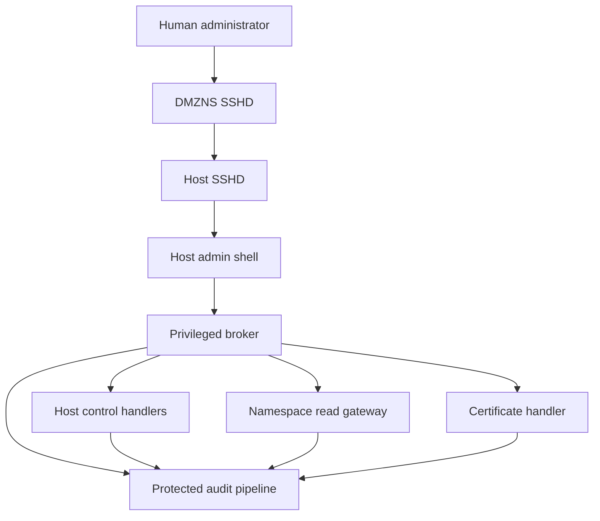

# Host Admin Customized Shell Design

_IT OT Separation SSHD RBAC_

| **Document status** | Design baseline   |
|---------------------|-------------------|
| **Version**         | 1.1               |
| **Date**            | 14 September 2026 |
| **Role**            | host-admin        |
| **Target plane**    | DUT Host plane    |

**Decision summary.** The host-admin receives a forced, allowlist-based administration shell on the Host plane. The role can manage approved Host networking, accounts, services, RDK-B parameters and host certificates. It can harvest logs and inspect redacted configuration from ITns, OTns and DMZns, but cannot modify those namespaces.

The design intentionally does not provide an unrestricted root shell. Privileged operations are implemented by a confined broker, and every request is validated and audited. This preserves the security value of the Host, IT, OT and DMZ separation model.

## 1 Purpose and Scope

This document specifies the customized shell and privileged command broker for the host-admin role. It defines the role boundary, permitted commands, protected resources, cross-namespace read access, audit behavior and acceptance criteria. It is intended for the SSHD, RBAC, platform security, RDK-B, networking and test teams.

### 1.1 System context

The DUT separates Host, ITns, OTns and DMZns into distinct security planes. A host administrator reaches the Host plane only through DMZNS. Online access starts with LDAP password authentication to DMZNS; offline access starts with a DMZNS SSH certificate. Both paths use a separate Host-plane certificate for the second hop and terminate as the local hostadmin identity.

### 1.2 Goals

- Provide the host-admin with sufficient Host-plane administration and troubleshooting capability.

- Prevent shell escape, arbitrary root command execution and cross-plane privilege expansion.

- Allow read-only configuration inspection and controlled log harvesting from ITns, OTns and DMZns.

- Protect audit logs, system time, CA trust and private-key material.

- Produce deterministic, attributable audit records for every operation.

### 1.3 Non goals

- Administering applications or configuration inside ITns, OTns or DMZns.

- Managing Enterprise LDAP or Active Directory identities.

- Providing a general-purpose root, sudo, container or namespace shell.

- Revoking or deleting certificates, administering a CA, or exporting private keys.

- Changing system time, audit policy, log retention or evidence files.

## 2 Design Decisions

| **ID** | **Decision**                       | **Design rule**                                                                                                                                            |
|--------|------------------------------------|------------------------------------------------------------------------------------------------------------------------------------------------------------|
| D1     | Forced command shell               | Host SSHD always starts the customized shell for hostadmin. User-supplied commands are treated as input to the shell grammar, not passed to a POSIX shell. |
| D2     | Single broker with policy profiles | Use one hardened command broker with a host-admin policy profile instead of placing elevated capabilities on the interactive shell.                        |
| D3     | Host-plane write boundary          | host-admin can change approved Host resources and host-side inter-zone enforcement, but cannot change configuration inside ITns, OTns or DMZns.            |
| D4     | Cross-namespace read gateway       | host-admin may harvest approved logs and inspect approved redacted configuration from all namespaces through a dedicated read-only gateway.                |
| D5     | No raw high-risk tools             | Write-capable nft, tc, ebtables, systemctl, dmcli and account-management operations are exposed only as validated broker actions.                          |
| D6     | Protected evidence                 | Logs and time are readable but immutable to host-admin. Audit data records both successful and rejected requests.                                          |
| D7     | Constrained certificate renewal    | host-admin may renew the fixed Host-plane device certificate, but cannot choose identity, CA role, principal, TTL or key export behavior.                  |

*Table 1 Core design decisions*

## 3 Architecture

The interactive process remains unprivileged. It authenticates the session, parses one command using an exact grammar and sends a canonical request to the privileged broker over a local UNIX domain socket. The broker verifies the peer credentials, resolves the server-side role policy, invokes one purpose-built handler and writes the result to the protected audit pipeline.



*Figure 1 Host admin forced shell and command broker architecture*

| **Component**          | **Responsibility**                                                                                                                   |
|------------------------|--------------------------------------------------------------------------------------------------------------------------------------|
| Host SSHD              | Authenticates the Host-plane SSH certificate and enforces ForceCommand, no forwarding, no tunnels and no user environment injection. |
| host-admin-shell       | Unprivileged interactive front end. Displays help, parses commands, validates syntax and submits canonical requests.                 |
| host-admin-brokerd     | Privileged policy enforcement point. Verifies peer identity, authorization, request limits and handler selection.                    |
| Host handlers          | Implement network, firewall, account, service, RDK-B, diagnostics and approved configuration transactions.                           |
| Namespace read gateway | Reads allowlisted logs and redacted configuration from ITns, OTns and DMZns without exposing a namespace shell.                      |
| Certificate handler    | Generates or reuses a TPM-backed key, creates a fixed-identity CSR, requests renewal and installs validated certificate material.    |
| Audit pipeline         | Stores append-only request, decision, state-change and result records outside host-admin control.                                    |

*Table 2 Component responsibilities*

### 3.1 Authorization flow

1.  Host SSHD validates the Host-plane user certificate and device-bound principal host-admin@kms-\<device-id\>.

2.  SSHD maps the session to the locked local account hostadmin and starts the forced shell.

3.  The shell records the SSH connection metadata and parses one permitted command without invoking /bin/sh.

4.  The broker validates UNIX peer credentials and resolves the host-admin policy from protected server-side configuration.

5.  The selected handler validates target names, paths, values, limits and protected invariants before performing an operation.

6.  The broker records the authorization decision, operation result and before/after state or hashes.

7.  The shell returns a bounded, sanitized result to the administrator.

## 4 Host Admin Permission Model

| **Capability**               | **Permitted**                                                                                        | **Mandatory restriction**                                                                                                        |
|------------------------------|------------------------------------------------------------------------------------------------------|----------------------------------------------------------------------------------------------------------------------------------|
| Network configuration        | View and change approved Host interfaces, routes, DNS, Wi-Fi, BLE and cellular settings.             | Interface and property allowlists; no arbitrary bridge, tunnel or namespace link.                                                |
| Firewall and traffic control | List, validate, apply and roll back approved nftables and tc policies.                               | Cannot remove mandatory default-drop, zone-isolation or audit rules; no raw write-capable nft, tc or ebtables.                   |
| Host configuration           | View and update approved files such as /etc/hosts and approved network, SSHD and SSSD configuration. | Staged edit, schema and syntax validation, protected-file allowlist, atomic installation and rollback.                           |
| Network diagnostics          | Use bounded ip, ss, ping, traceroute, dig, nslookup and tcpdump functions.                           | Target, interface, duration, packet count and output path limits; ifconfig and netstat are compatibility read-only views.        |
| Account lifecycle            | Create, suspend, resume and retire approved Host-local accounts.                                     | No UID or GID 0, sudo, privileged groups, arbitrary shell, LDAP or AD administration, or immediate evidence-destroying deletion. |
| Service control              | View status, reload and restart allowlisted Host services.                                           | No stop, disable, mask, arbitrary unit, transient unit or uncontrolled restart loop.                                             |
| System diagnostics           | View processes, resource usage, storage, uptime, hardware and approved kernel status.                | No arbitrary process execution, signal delivery, kernel modules, mount changes or protected sysctl writes.                       |
| RDK-B parameters             | Get and set allowlisted RDK-B parameters.                                                            | Type and range validation; security-disable, secret, factory-reset and unrestricted remote-access parameters are denied.         |
| Namespace logs               | Harvest approved logs from Host, ITns, OTns and DMZns; monitor and export collection jobs.           | Read-only source access, bounded bundles, integrity manifest and no lxc-attach, lxc exec or nsenter exposed to the user.         |
| Namespace configuration      | List, view, compare and export redacted approved configuration from ITns, OTns and DMZns.            | No write operation, arbitrary path, secret material, process environment or private-key access.                                  |
| Audit logs                   | Read, search and export approved host audit and system logs.                                         | Cannot delete, truncate, alter, rename, change permissions or change audit and retention policy.                                 |
| Time                         | View clock, timezone, RTC and synchronization status.                                                | Cannot set time or timezone, force NTP steps or change time-source configuration.                                                |
| Host certificate             | View status and renew or reissue the fixed Host-plane device certificate.                            | Cannot revoke, delete, issue user certificates, modify CA trust, choose arbitrary identity or export private keys.               |

*Table 3 Host admin authorization matrix*

### 4.1 Explicitly denied operations

- Start bash, sh, a scripting interpreter or any unrestricted command executor.

- Use sudo, su, lxc-attach, lxc exec, nsenter, podman exec or an equivalent namespace entry mechanism.

- Use shell metacharacters, pipelines, redirection, command substitution, glob expansion or user-controlled environment variables.

- Modify host-admin policy, broker binaries, SELinux policy, sudoers, AuthorizedPrincipalsFile, trusted SSH CA files or authorized_keys.

- Change configuration or service state inside ITns, OTns or DMZns.

- Delete or alter source logs, harvested evidence, audit records or integrity manifests.

- Stop, disable or mask required services; reboot, shut down, factory reset, install packages or update firmware.

- Change system time or audit configuration; revoke certificates or export TPM/private keys.

## 5 Command Interface

The shell exposes a namespaced command grammar. The parser accepts only documented tokens and option combinations. A request is rejected before broker execution when it contains an unknown verb, duplicate option, invalid identifier, unsupported value or shell metacharacter.

```text
hostctl network status
hostctl network interface show [<interface>]
hostctl network interface set-state <interface> <up|down>
hostctl network route show
hostctl firewall show
hostctl firewall validate <staged-policy-id>
hostctl firewall apply <validated-change-id>
hostctl firewall rollback <change-id>
hostctl diagnose ping <destination> [--count <1..20>]
hostctl diagnose capture <interface> --duration <1..300> [--filter <approved-filter>]
hostctl account <list|add|suspend|resume|retire> [<user>]
hostctl service <status|reload|restart> <approved-service>
hostctl rdkb get <approved-parameter>
hostctl rdkb set <approved-parameter> <validated-value>
hostctl logs harvest <host|itns|otns|dmzns|all> [--since <time>] [--until <time>]
hostctl logs job-status <job-id>
hostctl logs export <job-id>
hostctl namespace config <list|show|diff|export> <itns|otns|dmzns> [<config-id>]
hostctl time status
hostctl certificate <status|renew> --plane host
hostctl help [<domain>]
hostctl exit
```

| **Command domain** | **Backend**            | **Resource**                     | **Access mode**                 |
|--------------------|------------------------|----------------------------------|---------------------------------|
| network            | net-handler            | Host interfaces and routes       | Read and constrained write      |
| firewall           | firewall-handler       | Host and boundary policy         | Validated transaction only      |
| diagnose           | diagnostic-handler     | Network and system observations  | Bounded execution and output    |
| account            | account-handler        | Approved Host-local identities   | Lifecycle operation only        |
| service            | service-handler        | Allowlisted Host units           | Status, reload or restart       |
| rdkb               | rdkb-handler           | Allowlisted parameters           | Typed get or set                |
| logs               | log-harvestd           | Host and namespace log sources   | Read, package and export        |
| namespace config   | namespace-read-gateway | Approved redacted configuration  | Read-only                       |
| time               | time-status-handler    | Clock and synchronization status | Read-only                       |
| certificate        | cert-renew-handler     | Host-plane certificate           | Status and fixed-policy renewal |

*Table 4 Command to handler mapping*

## 6 Detailed Functional Design

### 6.1 Network and firewall changes

Network changes are policy transactions rather than direct execution of networking binaries. The handler loads a staged change by ID, checks its schema, validates interface and address ownership, verifies protected isolation invariants and performs a dry-run where supported. After applying the change, it verifies the expected management path and stores the prior state for rollback.

- Mandatory rules include WAN SSH denial, zone default-drop behavior, management-path allowlists and audit logging.

- The administrator cannot supply an arbitrary nftables script, executable path or output destination.

- A failed health check triggers automatic rollback and a high-severity audit event.

- ebtables compatibility is read-only; new bridging policy should be implemented with nftables where supported.

### 6.2 Configuration changes

Approved Host configuration is addressed by logical configuration ID, not by arbitrary filesystem path. The broker writes to a private staging area, rejects symlinks and unexpected ownership, validates format and service-specific syntax, creates a versioned backup and atomically replaces the target. SSHD and SSSD updates must pass their native configuration checks before reload or restart.

### 6.3 Service restart

A restart contains a short stop phase, but host-admin is not given an independent stop operation. The service handler accepts only an allowlisted unit, rate-limits requests, records its prior state, executes restart, waits for active state and runs the configured health check. The action fails closed when the unit name is aliased, templated or not listed in policy.

### 6.4 Account lifecycle

The account handler manages only approved Host-local accounts. Enterprise LDAP and Active Directory identities remain centrally managed. Add operations enforce allocated UID and GID ranges, a fixed home root and an approved login shell. Suspend locks authentication without removing ownership metadata. Retire disables the account and archives metadata; irreversible deletion is outside this role.

### 6.5 Cross namespace log harvesting

The host-admin role may initiate, monitor and export log-harvesting jobs from Host, ITns, OTns and DMZns. The privileged log-harvestd process reads only configured journal units and canonical file paths. Namespace entry, when technically required, occurs inside the broker and is never exposed as a user-controlled command.

| **Stage**  | **Requirement**                                                                                                  |
|------------|------------------------------------------------------------------------------------------------------------------|
| Request    | Namespace set, approved source or service, UTC time range, severity filter and bounded job limits.               |
| Collection | Read-only file descriptors; canonical paths; no symlink following; bounded duration, file count and total bytes. |
| Manifest   | DUT ID, namespace, boot ID, source, original timestamps, collection time, actor, session and SHA-256 hashes.     |
| Storage    | Protected spool owned by the broker. The administrator receives an opaque job ID and read-only export stream.    |
| Export     | Optional compression and signature; secrets and policy-defined sensitive fields are redacted before release.     |
| Retention  | Broker-controlled expiration. host-admin cannot delete original logs, bundles, manifests or audit records.       |

*Table 5 Log harvesting requirements*

### 6.6 Cross namespace configuration visibility

Configuration visibility is read-only and uses logical configuration IDs. The namespace gateway can show effective values, compare the current state with the approved baseline and export a redacted snapshot. It does not accept raw paths and does not provide file ownership, permission or service-control operations inside a namespace.

- Allowed examples include interface, route, firewall, SSHD, SSSD where present, service and approved application configuration.

- Always protected content includes private keys, password hashes, Vault tokens, AppRole secrets, LDAP bind credentials, API tokens, Wi-Fi keys, /run/secrets and sensitive process environments.

- Every view, comparison and export records the namespace and configuration ID. OT configuration may require an additional policy approval or ticket reference.

### 6.7 RDK-B parameter management

The RDK-B handler maintains an allowlist of parameter names, operation type, data type, range, restart impact and redaction behavior. It does not pass user input directly to dmcli. Set operations record the old and new value unless the field is sensitive, in which case only a non-secret state transition and value hash are recorded.

### 6.8 Certificate renewal

Certificate renewal is limited to the DUT Host-plane certificate. The handler derives the device ID, plane, principal, target, Vault role and TTL from protected configuration. It validates the returned chain, identity, validity and key binding before atomic installation. The private key remains TPM-backed and is never returned to the administrator or written into the audit log.

## 7 Security Enforcement

| **Threat**           | **Failure mode**                                                                               | **Required control**                                                                                              |
|----------------------|------------------------------------------------------------------------------------------------|-------------------------------------------------------------------------------------------------------------------|
| Shell escape         | Pipes, redirection, command substitution, editor or pager escapes lead to arbitrary execution. | No POSIX shell evaluation; exact parser; PAGER=cat; no general editor, interpreter or user environment.           |
| Argument injection   | A valid command is extended with a dangerous option or secondary command.                      | Per-command typed grammar, option allowlist, no duplicate options and direct execve-style handler invocation.     |
| Path traversal       | A log or configuration request reaches an arbitrary file or secret.                            | Logical IDs, canonical openat2-style resolution, no symlink following and directory file descriptors.             |
| TOCTOU replacement   | A validated staged file is replaced before installation.                                       | Broker-owned staging, file descriptor based validation, ownership checks, hashes and atomic rename.               |
| Cross-plane bypass   | Host privilege is used to modify IT, OT or DMZ configuration.                                  | Separate namespace read gateway, no write handlers, no exposed setns or LXC commands and SELinux confinement.     |
| Audit tampering      | Administrator changes time, logs or collection manifests.                                      | No write capability to audit paths or time services; append-only remote forwarding where available.               |
| Operational denial   | Repeated restart, capture or harvest jobs exhaust resources.                                   | Rate limits, concurrency limits, quotas, timeouts, circuit breakers and bounded output.                           |
| Credential exposure  | Diagnostics or config exports reveal secrets or private keys.                                  | Source allowlists, redaction, protected path denylist, output inspection and no private-key APIs.                 |
| Broker impersonation | A local process submits host-admin requests.                                                   | UNIX peer credentials, fixed socket ownership, authenticated session context and server-side UID-to-role mapping. |

*Table 6 Threats and required mitigations*

### 7.1 Broker and service hardening

- Run the shell as the unprivileged hostadmin account and prohibit privilege inheritance.

- Run broker handlers as separate services or domains where practical; grant only required Linux capabilities and filesystem paths.

- Use SELinux domains such as host_admin_shell_t, host_admin_broker_t and host_log_harvest_t with explicit transitions and no broad unconfined access.

- Use systemd hardening including a restrictive capability bounding set, protected kernel tunables and control groups, private temporary storage and explicit read-write paths.

- Pin handler executable paths and hashes; reject user-controlled PATH, LD_PRELOAD, locale, editor and pager variables.

- Return bounded output and sanitized errors without backend stack traces, tokens, private paths or secret values.

## 8 Audit Design

The audit pipeline records attempts as well as successful operations. The shell emits a request record before broker execution; the broker emits authorization, state-change and completion records. Records use the system UTC clock, which host-admin cannot change, and should be forwarded to a remote collector when available.

### 8.1 Per-user command log

Every command execution attempt, including malformed, unauthorized, denied, successful and failed commands, shall be logged in `/var/log/custom-shell/${role}-${uid}.log`. The shell and broker shall derive role and UID from the authenticated session and protected server-side identity mapping; neither value may be supplied or overridden by the user. For the host-admin account defined by this design, UID 10000 therefore writes to `/var/log/custom-shell/host-admin-10000.log`.

The file shall use JSON Lines format with one complete audit record per line. A completion record shall be written after command processing so that event_result reflects the final outcome. A failed event shall include a non-secret failed_reason that is specific enough for operations and investigation; a successful event shall omit failed_reason or set it to null.

| **Field**    | **Required content**                                                                                                              |
|--------------|-----------------------------------------------------------------------------------------------------------------------------------|
| timestamp    | UTC RFC 3339 timestamp with timezone and sub-second precision.                                                                    |
| source       | Human user account, mapped local account and numeric UID that initiated the command.                                              |
| category     | Controlled classification such as network, firewall, service, account, rdkb, logs, namespace-config, time, certificate or system. |
| type         | Controlled event type, for example command.completed, command.denied or command.failed.                                           |
| event ID     | Unique event_id for the individual record; correlation_id links records in one session or operation.                              |
| event result | success or fail. failed_reason is mandatory when the result is fail and shall not expose secrets.                                 |
| command      | Canonical command, sanitized arguments and target resource or namespace.                                                          |

*Table 7 Mandatory local command audit fields*

The /var/log/custom-shell directory shall be owned by root or the dedicated audit service with mode 0750. Audit files shall be mode 0640 and writable only through the trusted audit path. host-admin may read approved audit data but shall not modify, delete, rename, truncate, chmod or redirect output into an audit file. Rotation shall be performed only by the root-owned logging service, preserve ownership and permissions, retain the configured history and continue remote forwarding when available.

| **Field group**  | **Required data**                                                                                                                              |
|------------------|------------------------------------------------------------------------------------------------------------------------------------------------|
| Event identity   | event_id, type, correlation_id and schema_version                                                                                              |
| Time             | timestamp in UTC RFC 3339 format, monotonic duration and boot_id                                                                               |
| Source           | human user account, mapped local account, numeric UID, role and online or offline authentication path                                          |
| Classification   | controlled category and type values                                                                                                            |
| SSH context      | source address, SSH connection or session ID, certificate serial, fingerprint and principal                                                    |
| Request          | canonical command, sanitized arguments, target namespace or resource and optional change-ticket ID                                             |
| Authorization    | policy version, decision, denial reason and selected handler                                                                                   |
| Change evidence  | before and after value or hash, backup ID and rollback status                                                                                  |
| Result           | event_result as success or fail; failed_reason is required on failure; include exit category, duration, bytes returned and health-check result |
| Harvest evidence | job ID, sources, time range, file count, byte count, manifest hash and bundle hash                                                             |

*Table 8 Extended audit record fields*

## 9 Policy Configuration

Authorization policy is stored in a root-owned, integrity-protected server-side file. The session cannot select or override its role. Policy changes require a controlled software or configuration deployment and are not available through hostctl.

```yaml
role: host-admin
identity:
  local_user: hostadmin
  principal_pattern: host-admin@kms-<device-id>
permissions:
  host_network: constrained-write
  host_firewall: validated-transaction
  host_accounts: lifecycle-only
  host_services: [status, reload, restart]
  namespace_logs: [host, itns, otns, dmzns]
  namespace_config: redacted-read-only
  system_time: status-only
  host_certificate: [status, renew]
denied:
  - arbitrary-shell
  - namespace-write
  - service-stop-disable-mask
  - audit-or-time-change
  - certificate-revoke-delete-export
```

## 10 Failure Handling

| **Condition**                     | **Required behavior**                                                                                                           |
|-----------------------------------|---------------------------------------------------------------------------------------------------------------------------------|
| Invalid syntax or unknown command | Reject locally, show the relevant usage and audit the rejection.                                                                |
| Authorization denial              | Return a generic permission error; record the policy rule and detailed reason only in protected audit data.                     |
| Validation failure                | Do not change state; preserve the staged object for authorized review subject to retention policy.                              |
| Partial configuration failure     | Restore the prior version atomically and record rollback status.                                                                |
| Service fails health check        | Attempt configured rollback or recovery; do not expose an independent stop state to the user.                                   |
| Namespace unavailable             | Mark harvest or view job failed for that namespace; do not weaken isolation or retry without limits.                            |
| Audit pipeline unavailable        | Fail closed for state-changing operations; allow only explicitly approved read-only diagnostics with local protected buffering. |
| Certificate renewal failure       | Keep the existing valid certificate; do not replace trust material until full validation succeeds.                              |

*Table 9 Failure behavior*

## 11 Acceptance Criteria

| **ID**   | **Verification**                                                                                                                                                                                 | **Required result** |
|----------|--------------------------------------------------------------------------------------------------------------------------------------------------------------------------------------------------|---------------------|
| AUTH-01  | A valid device-bound Host-plane host-admin certificate reaches the forced shell through DMZNS.                                                                                                   | Pass                |
| AUTH-02  | A DMZNS-only, wrong-plane, wrong-role, expired or wrong-device certificate is rejected by Host SSHD.                                                                                             | Pass                |
| SHELL-01 | bash, sh, sudo, su, pipes, redirection, command substitution and interpreter execution are rejected and audited.                                                                                 | Pass                |
| SHELL-02 | Unknown commands, options, duplicate options and overlong input are rejected before privileged execution.                                                                                        | Pass                |
| NET-01   | Approved network and firewall changes validate, apply, health-check and support rollback.                                                                                                        | Pass                |
| NET-02   | Attempts to remove protected default-drop, WAN SSH denial or zone-isolation rules are rejected.                                                                                                  | Pass                |
| SVC-01   | Allowlisted services can be restarted and return to active state; stop, disable and mask are denied.                                                                                             | Pass                |
| ACCT-01  | Approved account lifecycle works; UID/GID 0, sudo membership, arbitrary shells and LDAP/AD changes are denied.                                                                                   | Pass                |
| NS-01    | host-admin can harvest approved logs from Host, ITns, OTns and DMZns with a complete integrity manifest.                                                                                         | Pass                |
| NS-02    | host-admin can view and diff approved redacted namespace configuration but cannot change it.                                                                                                     | Pass                |
| NS-03    | lxc-attach, lxc exec, nsenter and arbitrary namespace path access are denied.                                                                                                                    | Pass                |
| LOG-01   | Original logs, bundles, manifests and audit records cannot be modified or deleted by host-admin.                                                                                                 | Pass                |
| TIME-01  | Clock and synchronization status are visible; all time and timezone changes are denied.                                                                                                          | Pass                |
| CERT-01  | Host certificate renewal uses the fixed identity and TPM-backed key and installs only a fully validated certificate.                                                                             | Pass                |
| CERT-02  | Certificate revoke, delete, arbitrary identity, user-certificate issue, CA modification and private-key export are denied.                                                                       | Pass                |
| AUD-01   | Every accepted, denied, malformed and failed command writes a completion record to `/var/log/custom-shell/${role}-${uid}.log` with timestamp, source, category, type, event ID and event result. | Pass                |
| AUD-02   | A failed command records event_result=fail and a non-secret failed_reason; a successful command records event_result=success and no failure reason.                                              | Pass                |
| AUD-03   | host-admin cannot modify, delete, rename, truncate, chmod or redirect output into its audit file; rotation preserves ownership, mode and continuity.                                             | Pass                |
| DOS-01   | Restart, packet capture, export and harvesting limits prevent unbounded concurrent or repeated work.                                                                                             | Pass                |

*Table 10 Acceptance test baseline*

## 12 Implementation Deliverables

| **Work product** | **Required content**                                                                                                                      |
|------------------|-------------------------------------------------------------------------------------------------------------------------------------------|
| Shell            | /usr/libexec/sshd-rbac-shell with host-admin command grammar, help and bounded output.                                                    |
| Broker           | host-admin-brokerd UNIX socket service with peer-credential validation and handler dispatch.                                              |
| Handlers         | Network, firewall, diagnostics, account, service, RDK-B, namespace read, log harvest, time status and certificate renewal handlers.       |
| Policy           | Root-owned host-admin policy containing resource allowlists, limits, protected invariants and policy version.                             |
| SSHD             | Retain the approved current Host SSHD configuration without modification in this audit revision; perform compatibility verification only. |
| MAC              | SELinux policy for the shell, broker, handlers, log spool and protected audit flow.                                                       |
| Audit            | Structured event schema, protected local buffer, remote forwarding integration and retention behavior.                                    |
| Tests            | Unit tests for parsers and policy; integration, negative, privilege-escalation, isolation and resource-exhaustion tests.                  |
| Operations       | Allowlist inventory, recovery and rollback procedures, monitoring metrics and incident-response guidance.                                 |

*Table 11 Implementation work products*

## 13 Parameters to Finalize

The following values are deployment policy, not architecture changes. They must be finalized before implementation freeze and recorded in the protected host-admin policy.

- Allowlisted Host services and the health check for each service.

- Permitted Host configuration IDs and validators, including SSHD and SSSD rollback rules.

- Protected firewall invariants and approved interface inventory.

- Local-account UID/GID allocation, home root and retirement retention period.

- RDK-B parameter allowlist, types, ranges and sensitivity classification.

- Namespace log sources, configuration IDs, redaction rules, OT approval requirements and maximum export size.

- Packet-capture duration, file-size and destination limits.

- Certificate renewal threshold, TTL, retry policy and health-monitoring behavior.

## Appendix A SSHD Configuration Preservation

This audit-log revision shall not add, remove or modify any SSHD directive. The deployed SSHD configuration remains the approved current baseline and is outside the scope of this change. Command audit logging shall be implemented entirely in the customized shell, privileged broker and protected logging service. Any future SSHD configuration change requires a separate design review, validation and deployment.

## Appendix B Recommended Audit Event Example

```json
{
  "timestamp": "2026-09-14T07:42:18.314Z",
  "source": {
    "human_account": "hostadmin01",
    "local_account": "hostadmin",
    "uid": 10000
  },
  "role": "host-admin",
  "category": "logs",
  "type": "command.completed",
  "event_id": "<unique-event-id>",
  "correlation_id": "<session-operation-id>",
  "principal": "host-admin@kms-1347938443",
  "source_address": "<management-address>",
  "command": "logs.harvest",
  "target": "otns",
  "event_result": "success",
  "failed_reason": null,
  "job_id": "<opaque-id>",
  "policy_version": "<version>",
  "manifest_sha256": "<hash>"
}
```

Failure example: set event_result to fail and include a stable, non-secret failed_reason such as authorization_denied, invalid_argument or health_check_failed. The event shall retain the attempted canonical command and target.
