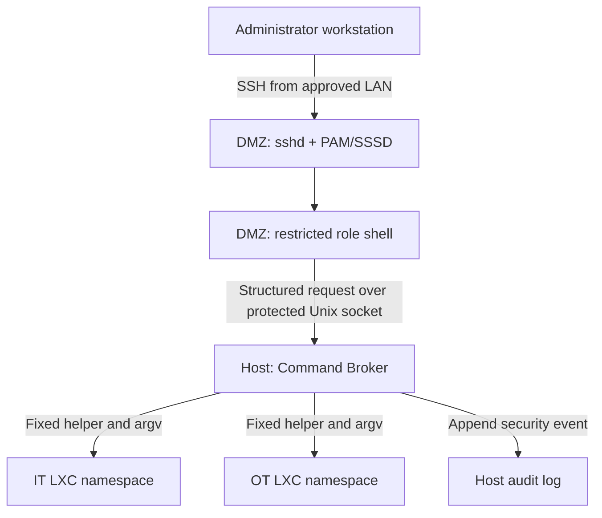
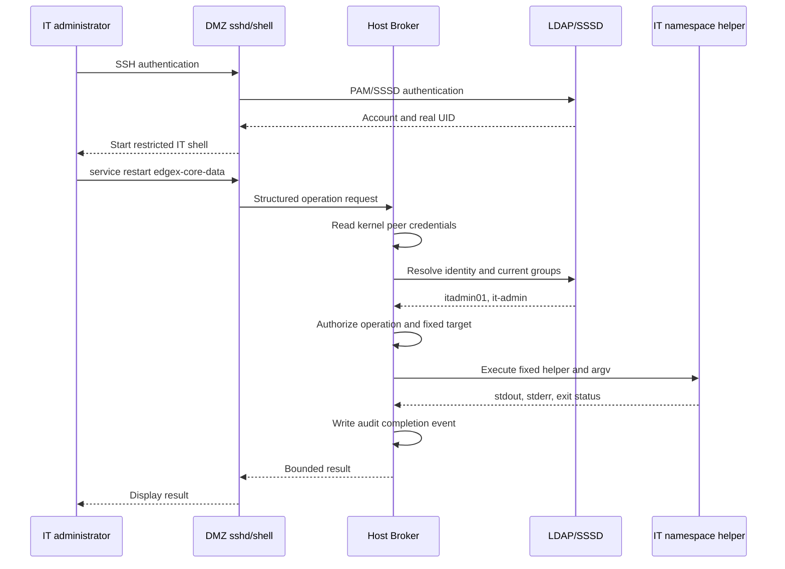

# IT/OT Restricted SSH Command Broker Design

**Document status:** Draft Design  
**Version:** 1.0  
**Date:** 2026-09-04  
**Scope:** AIoT gateway using unprivileged LXC namespaces for Host, DMZ, IT, and OT separation

## 1. Purpose

This document defines a controlled administrative access design in which an authenticated administrator uses a restricted SSH management shell. The shell sends structured requests to a privileged Host Command Broker. After independently identifying and authorizing the caller, the broker executes only approved operations inside the caller's authorized LXC zone and returns the result.

The design avoids reliance on Linux ambient capabilities, which are non-functional on the target kernel. It also avoids granting an unrestricted root shell to roles whose duties can be represented by a bounded set of administrative operations.

## 2. Design objectives

- Preserve the administrator's real LDAP/Linux identity in the SSH session.
- Keep `whoami` and `id` truthful; for example, `itadmin01` remains a non-root UID.
- Allow approved administrative actions without granting the user general root access.
- Ensure an IT administrator can affect only the IT namespace.
- Ensure an OT administrator can affect only the OT namespace.
- Keep privileged policy enforcement and audit records on the Host.
- Prevent command injection, parameter injection, namespace selection, and identity spoofing.
- Deny all operations that are not explicitly defined in policy.
- Return bounded stdout, stderr, exit status, and diagnostic information to the SSH client.

## 3. Non-goals

This design does not provide:

- An unrestricted Bash or root shell for limited administrator roles.
- Arbitrary `sudo`, `su`, `nsenter`, `lxc-attach`, or Host command execution.
- Arbitrary executable paths, shell expressions, environment variables, or working directories.
- General-purpose interactive editors through the privileged broker.
- Cross-zone administration.
- Capability inheritance through ambient capabilities or `PR_SET_KEEPCAPS`.
- Password re-entry at the Host Broker. The Host re-identifies and re-authorizes the established caller but does not request the LDAP password again in this phase.

## 4. Security zones and components



| Component | Location | Privilege | Responsibility |
|---|---|---:|---|
| `sshd` | DMZ | DMZ service privilege | SSH transport and PAM authentication |
| SSSD/PAM | DMZ | Service privilege | LDAP authentication and initial account resolution |
| Restricted role shell | DMZ | Real user UID | Parse supported commands and submit structured requests |
| Broker socket client | DMZ | Real user UID | Connect to the protected broker endpoint; no authorization decision |
| Host Command Broker | Host | Host root or minimal required Host capability | Identify caller, authorize operation, select fixed zone/helper, audit and supervise execution |
| Zone helper | IT or OT LXC | Zone root only when required | Perform one narrowly defined operation |
| Audit service/log | Host | Host-controlled | Record tamper-resistant session and operation events |

The Host Broker is the security enforcement point. The restricted shell improves usability and reduces accidental misuse, but it is not a trusted authorization boundary.

## 5. Role model

| LDAP group | Example user | Login endpoint | Target | Session UID | Privilege model |
|---|---|---|---|---:|---|
| `it-admin` | `itadmin01` | DMZ SSH | IT namespace | Real LDAP UID | Restricted management operations through broker |
| `ot-admin` | `otadmin01` | DMZ SSH | OT namespace | Real LDAP UID | Restricted operations, or zone root only if the approved duty genuinely requires arbitrary administration |
| `dmz-admin` | `dmzadmin01` | DMZ SSH | DMZ namespace | Real LDAP UID | Restricted DMZ management operations |
| `ot-operator` | `otoperator01` | DMZ SSH | OT namespace | Real LDAP UID | Smaller operational allowlist; no configuration administration |
| `host-admin` | `hostadmin01` | Dedicated Host administration path | Host | Host root after strong authorization | Full Host administration; excluded from this limited-command path |
| `auditor` | `auditor01` | Approved audit path | Host/aggregated records | Real LDAP UID | Read-only audit and status operations |

Role membership must be resolved from the authoritative identity source at authorization time. A username or role supplied in the request is never authoritative.

## 6. End-to-end session flow



### 6.1 Authentication

1. The user connects to the DMZ `sshd` from an approved management network.
2. PAM and SSSD authenticate the user against LDAP.
3. `sshd` starts the restricted shell as the user's real UID and primary GID.
4. `ForceCommand` prevents the user from selecting a normal login shell or an arbitrary remote command.

### 6.2 Broker authorization

1. The restricted shell connects to a Host-owned Unix-domain socket exposed only at a fixed DMZ path.
2. The Host Broker obtains the kernel-authenticated peer UID/GID/PID using `SO_PEERCRED` or the equivalent supported mechanism.
3. For an unprivileged LXC, the broker validates that the peer UID is within the DMZ idmap and converts it to the container-relative UID.
4. The broker resolves that UID through the trusted identity database and obtains current LDAP group membership.
5. The broker maps the verified role to exactly one target zone and an operation policy.
6. The broker rejects unknown, disabled, expired, locked, ambiguous, or unauthorized identities.

No password re-entry occurs at the broker. This is session binding plus independent authorization, not a second password authentication.

### 6.3 Execution

1. The broker validates the protocol version, operation name, resource identifier, and typed parameters.
2. The broker maps them to a fixed container, helper executable, argument vector, timeout, output limit, UID/GID, and environment.
3. The broker enters only the policy-selected LXC namespace.
4. The zone helper performs the narrow operation and returns an exit status.
5. The broker captures bounded output, records the result, and returns it to the restricted shell.

## 7. Restricted shell

The shell is a purpose-built management CLI, not a command-filtering wrapper around Bash.

Example:

```text
Restricted IT Management Shell
Authenticated user: itadmin01
Authorized role: it-admin
Target zone: IT

it-admin> service status edgex-core-data
it-admin> service restart edgex-core-data
it-admin> logs edgex-core-data --lines 100
it-admin> config show mqtt
it-admin> network show
it-admin> help
it-admin> exit
```

The following are not accepted:

```text
bash
sh
sudo
su
nsenter
lxc-attach
systemctl arbitrary.service
service restart "x; /bin/sh"
```

The shell should support only built-in parsing, help, request submission, result rendering, cancellation, and logout. It must not pass user input to `system()`, `popen()`, `sh -c`, `bash -c`, `eval`, or shell interpolation.

## 8. Request and response protocol

Use a versioned, framed protocol over an `AF_UNIX` `SOCK_SEQPACKET` socket where supported. A length-prefixed stream protocol is acceptable if message boundaries and maximum lengths are enforced.

Example request:

```json
{
  "protocol_version": 1,
  "request_id": "edee038f-52f4-4a8f-a25a-41048c5fb2ac",
  "operation": "service.restart",
  "resource": "edgex-core-data",
  "parameters": {}
}
```

Example response:

```json
{
  "protocol_version": 1,
  "request_id": "edee038f-52f4-4a8f-a25a-41048c5fb2ac",
  "status": "completed",
  "exit_code": 0,
  "stdout": "edgex-core-data.service restarted\n",
  "stderr": "",
  "truncated": false,
  "duration_ms": 328
}
```

The request must not contain an authoritative username, role, container name, namespace PID, UID/GID, executable path, working directory, environment, or raw command string.

## 9. Policy and command mapping

Example conceptual policy:

```yaml
roles:
  it-admin:
    target_zone: it
    operations:
      service.status:
        resources:
          - edgex-core-data
          - edgex-core-metadata
          - edgex-core-command
      service.restart:
        resources:
          - edgex-core-data
          - edgex-core-metadata
          - edgex-core-command
        approval: none
        timeout_seconds: 30
      logs.read:
        resources:
          - edgex-core-data
          - edgex-core-metadata
          - edgex-core-command
        maximum_lines: 1000
      network.show: {}
      disk.show: {}

  ot-operator:
    target_zone: ot
    operations:
      service.status:
        resources:
          - chirpstack
          - mosquitto
      logs.read:
        resources:
          - chirpstack
          - mosquitto
        maximum_lines: 500
```

The production policy should be owned by Host root, immutable to zone administrators, version-controlled, syntax-validated, and fail closed. Reload should be atomic and audited.

Example internal mapping:

```text
(role=it-admin, operation=service.restart, resource=edgex-core-data)
    -> zone=it
    -> helper=/usr/local/libexec/it-service-control
    -> argv=["it-service-control", "restart", "edgex-core-data"]
    -> execution identity=uid 0 inside IT LXC
    -> timeout=30 seconds
```

The broker must use `execve()` or an equivalent no-shell API with a fixed executable and separately validated arguments.

## 10. Zone helper design

Prefer small, operation-specific helpers over exposing general-purpose programs.

Recommended helpers include:

- `zone-service-control status|restart <approved-service>`
- `zone-log-read <approved-service> <validated-line-count>`
- `zone-network-show`
- `zone-disk-show`
- `zone-config-show <approved-component>`
- `zone-config-apply <approved-component> <validated-staged-object>`

Each helper must:

- Revalidate its arguments independently.
- Use fixed service/configuration mappings.
- Reject path traversal, symlinks and unexpected file types.
- Open files safely, using `openat2()` protections where available.
- Use atomic file replacement and preserve ownership/mode.
- Avoid loading user-controlled plugins, startup files or locale data.
- Set a minimal fixed environment and safe `PATH`.
- Close inherited file descriptors.
- Return deterministic exit codes.

Avoid privileged use of `vi`, `vim`, `less`, `find`, `tar`, `cp`, interpreters, compilers, package managers or any tool that can execute another program. Configuration changes should use typed operations, validation and controlled staging rather than an interactive editor.

## 11. Namespace and Host isolation

Privileged operations must run inside the authorized target namespace. They must not run in the Host execution context.

Example conceptual invocation:

```text
lxc-attach -n it-zone --clear-env --
    /usr/local/libexec/it-service-control
    restart edgex-core-data
```

In implementation, the container name, helper, arguments and execution identity are selected solely by Host policy. The user cannot supply `lxc-attach` or `nsenter` parameters.

Required LXC controls:

- Use unprivileged containers.
- Maintain non-overlapping UID/GID mappings for DMZ, IT and OT.
- Do not expose Host container-management, Docker or Podman sockets.
- Do not grant unnecessary devices, mounts or Host paths.
- Keep shared executable/configuration mounts read-only unless explicitly required.
- Do not add broad capabilities such as `CAP_SYS_ADMIN` to containers.
- Apply SELinux/AppArmor and seccomp restrictions where supported.
- Prevent zone root from modifying the Host Broker, Host policy, broker socket ownership or Host audit log.

## 12. Broker socket security

- The Host owns the socket and its parent directory.
- Only the restricted DMZ client domain/group may connect.
- Ordinary DMZ processes and other zones must not access the socket.
- Use kernel peer credentials for identity binding.
- Apply SELinux/AppArmor labeling to limit which process type may connect.
- Limit connections per UID and globally.
- Enforce request size, nesting depth, string length and rate limits.
- Reject ancillary file descriptors and unexpected control messages.
- Do not expose a generic Host RPC, filesystem proxy or command endpoint.
- On broker restart, invalidate incomplete requests and generate audit events.

Compromise of the DMZ must not automatically grant Host command execution. The broker's allowlist, peer validation and fixed zone mapping remain mandatory even if the restricted shell is bypassed.

## 13. Output and resource controls

For every operation, enforce:

- Wall-clock timeout.
- Maximum stdout and stderr bytes.
- Maximum concurrent requests globally and per identity.
- Request rate limit.
- Maximum log records/lines.
- Cancellation and child-process cleanup.
- Process group isolation.
- Fixed CPU, memory and process limits where practical.

Do not provide unrestricted PTY forwarding. Full-screen interactive applications are outside the limited-command design. Secrets must be redacted from output and audit records.

## 14. Audit requirements

The Host Broker must record both the authenticated human identity and privileged execution identity.

Minimum start/completion fields:

```text
timestamp
event_type
request_id
session_id
authenticated_username
container_relative_uid
host_mapped_peer_uid
LDAP groups or authorization-policy version
authorized_role
SSH source IP and source port
target_zone
operation
resource
normalized non-secret parameters
execution_uid
authorization result and reason code
start/end time and duration
exit_code
output_truncated flag
broker and policy version
```

Example:

```text
timestamp=2026-09-04T09:15:22Z event=command_complete
request_id=edee038f session_id=8b7c91 user=itadmin01
peer_host_uid=1401001 role=it-admin source_ip=192.168.1.50
operation=service.restart resource=edgex-core-data target_zone=it
execution_uid=0 result=success exit_code=0 duration_ms=328
policy_version=7
```

Audit records must be writable only by the broker/audit subsystem, protected against unauthorized deletion or modification, rotated according to policy, and forwarded to the approved remote SIEM where available. Do not log passwords, tokens, private keys or full secret configuration values.

## 15. Failure behavior

The design fails closed:

- LDAP/SSSD or identity lookup unavailable: deny new privileged operations.
- UID mapping invalid or ambiguous: deny.
- Group membership missing or changed: deny.
- Policy missing, invalid or unsigned where signing is required: deny.
- Unknown protocol version/operation/resource: deny.
- Target container stopped: return a controlled failure; do not fall back to Host execution.
- Helper missing or hash/ownership/mode validation fails: deny and alert.
- Timeout/output overflow: terminate the operation, mark the response, and audit.
- Audit subsystem unavailable: deny security-sensitive modifying operations according to fail-closed policy.

## 16. Security considerations

### 16.1 Identity spoofing

The broker must never trust request-provided username, UID, GID, role, session ID or target zone. Identity is derived from kernel peer credentials and the authoritative directory. A request session ID is only a correlation value unless it was issued and cryptographically bound by a trusted Host component.

### 16.2 Command injection

No user-controlled request may be interpreted by a shell. Operation/resource values are matched as exact identifiers and mapped to fixed `execve()` argument vectors.

### 16.3 Confused deputy

The broker verifies that the authenticated role, operation, resource and target zone form one explicitly allowed tuple. IT requests can never select OT, DMZ or Host targets.

### 16.4 TOCTOU and filesystem attacks

Helpers use safe file descriptors, reject symlinks, validate final objects, perform atomic replacement and avoid writable search paths. Policy and helper files are Host/zone-root owned and not writable by the requesting user.

### 16.5 Broad operations

Any operation that accepts arbitrary paths, commands, scripts, unit names, environment variables or file content can collapse the restricted model into root-equivalent access. Such requirements must undergo threat review or be classified as a zone-root administrator function.

## 17. Verification plan

### 17.1 Functional tests

- Authorized IT Admin can query and restart every approved IT service.
- Result includes correct stdout, stderr and exit code.
- Timeout, cancellation and output truncation behave deterministically.
- `whoami` remains the real LDAP user in the restricted SSH shell.
- Every request produces matching Host start/completion audit events.

### 17.2 Authorization tests

- IT Admin cannot request OT, DMZ or Host operations.
- OT Operator cannot perform OT Admin changes.
- Auditor cannot perform modifying operations.
- Removed LDAP group membership takes effect according to the defined cache/revalidation policy.
- Locked and disabled accounts cannot submit new operations.

### 17.3 Adversarial tests

- Attempt separators, quoting, substitution, newline and Unicode confusion in every field.
- Attempt path traversal, absolute paths, symlinks and special files.
- Attempt arbitrary service names and unit aliases.
- Attempt oversized, deeply nested, partial and malformed messages.
- Attempt forged username, UID, role, zone and session ID fields.
- Attempt socket access from unrelated DMZ services, IT/OT containers and local Host users.
- Attempt concurrent request exhaustion and output flooding.
- Kill the client, helper, container and broker during each execution stage.
- Verify that container failure never causes fallback to Host execution.

### 17.4 Isolation tests

- Confirm all zone UID/GID ranges are non-overlapping.
- Confirm zone root maps to an unprivileged Host UID.
- Confirm IT helpers cannot access Host or OT resources.
- Confirm the Host Broker socket, executable, policy and logs are not writable by any zone administrator.

## 18. Deployment plan

1. Define the first minimal operation catalog for each role.
2. Implement the versioned request/response schema and restricted shell.
3. Implement Host peer-credential and DMZ idmap validation.
4. Implement Host LDAP/SSSD role resolution and deny-by-default policy.
5. Implement one zone helper for `service.status` and `service.restart`.
6. Add timeouts, output limits, concurrency control and complete auditing.
7. Apply socket permissions and SELinux/AppArmor rules.
8. Run functional, authorization, adversarial and namespace-isolation tests.
9. Add further operations individually after threat review.
10. Keep an emergency Host administration path separate from the restricted role path.

## 19. Decision summary

The selected design is:

- `it-admin`, `dmz-admin`, `ot-operator`, and bounded `ot-admin` sessions retain their real LDAP UID.
- A custom restricted SSH shell exposes only approved management verbs and resources.
- A Host Command Broker independently identifies the caller and rechecks current authorization.
- The broker translates structured requests into fixed helpers and argument vectors.
- Privileged execution occurs only inside the policy-selected LXC namespace.
- The Host records the human identity, requested operation and privileged execution result.
- Ambient capabilities and general per-tool file capabilities are not required.
- Roles requiring genuinely arbitrary zone administration must be explicitly classified as zone-root roles rather than hidden behind an ineffective command allowlist.

## Appendix A — Initial IT Admin operation catalog

| Operation | Parameters | Execution privilege | Notes |
|---|---|---:|---|
| `service.list` | None | Read-only helper | Returns approved services only |
| `service.status` | Approved service ID | Read-only helper | Fixed unit mapping |
| `service.restart` | Approved service ID | IT zone root | Timeout and post-check required |
| `logs.read` | Service ID, 1–1000 lines | Read-only helper | Secret redaction required |
| `network.show` | None | Read-only helper | No raw packet capture by default |
| `disk.show` | None | Read-only helper | Fixed filesystem set |
| `config.show` | Approved component | Read-only helper | Redact secrets |
| `config.validate` | Approved staged object | Component helper | No active change |
| `config.apply` | Approved staged object | IT zone root | Validate, atomic replace, audit and rollback |

## Appendix B — Operations excluded by default

- Arbitrary shell or script execution
- Arbitrary `systemctl` or service/unit names
- Package installation or removal
- Kernel module management
- Mount or namespace management
- Container lifecycle management
- Arbitrary file read/write/copy/chown/chmod
- Interactive editor, pager or debugger
- Network firewall/routing modification
- User/group/password management
- Access to private keys, tokens or unredacted secrets
- Host reboot or shutdown

