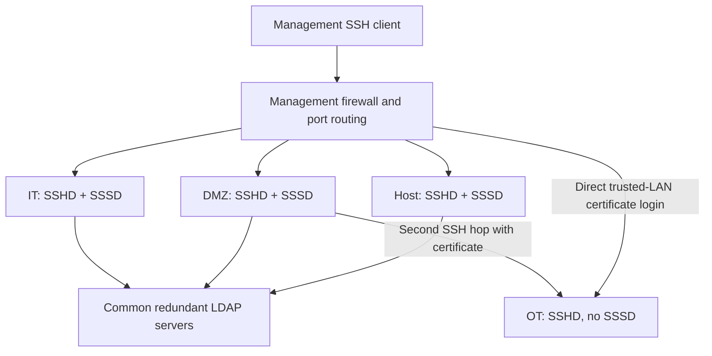
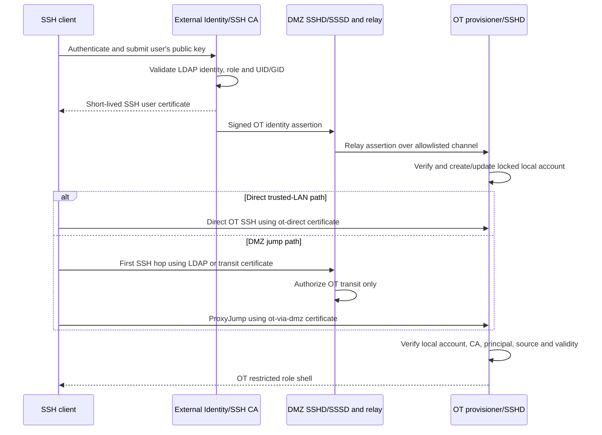
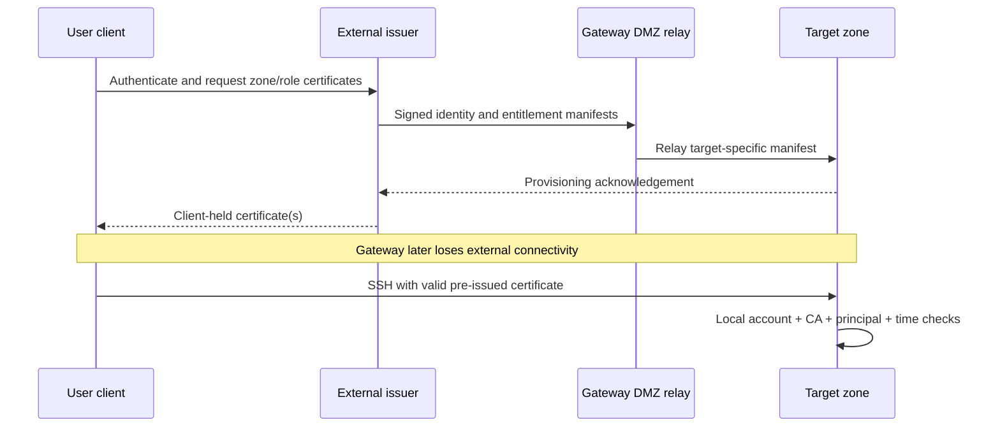
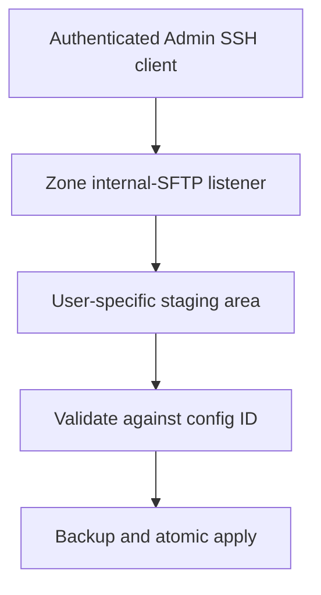

# Solution B — Dual-Path OT and Restricted SSH Administration Design

**Document ID:** AIOT-SEC-SSH-SB  
**Version:** 2.4  
**Date:** 2026-09-04  
**Target:** AIoT gateway with unprivileged LXC zones

## 1. Purpose and decisions

This design provides role-controlled SSH administration for Host, DMZ, IT and OT. Host, DMZ and IT run SSHD with SSSD while online. OT runs SSHD but has no SSSD, LDAP route or Internet access. OT supports two management paths: direct access from the trusted LAN and a second-hop path through DMZ. WAN access to every SSHD remains prohibited. When the gateway cannot reach external identity services, all zones support pre-issued, time-limited SSH user certificates. The LDAP username remains the Linux identity shown by `whoami` and `id`.

Decisions:

- `it-admin`, `ot-admin`, `dmz-admin` and `host-admin` can run approved commands, manage approved services and change only allowlisted configuration files in their authorized zone.
- `ot-admin` and `ot-operator` may connect directly from the trusted LAN using an OT direct-login certificate or connect through DMZ using separate DMZ transit and OT second-hop certificates.
- In offline mode, Host, DMZ and IT replace unavailable LDAP authentication with externally pre-issued zone-specific SSH user certificates; authorization never becomes less restrictive.
- Configuration uploads originate only from an authenticated SSH client and land in a non-executable staging directory; uploads never directly overwrite production files.
- `ot-operator` can run limited operational commands, view status/logs and restart selected OT services, but cannot change any file.
- `auditor` logs in only to Host and receives read-only access.
- No role receives arbitrary commands, arbitrary paths, unrestricted `sudo` or a general root shell.
- Ambient capabilities and capability inheritance are not used.

## 2. Architecture



Host, DMZ and IT connections terminate directly in the selected zone. OT accepts either a direct certificate-authenticated connection from the trusted LAN or an end-to-end certificate-authenticated session through the DMZ jump host. The user's private keys and certificates remain on the client. No `lxc-attach`, `nsenter`, agent forwarding or private-key storage in DMZ is used.

| Zone | Accepted LDAP groups | Components | Scope |
|---|---|---|---|
| Host | `host-admin`, `auditor` | SSHD, SSSD, restricted shells, helpers, audit view | Host |
| DMZ | `dmz-admin`, `ot-admin`, `ot-operator` | SSHD, SSSD, DMZ admin shell, OT jump shell | DMZ admin or OT transit only |
| IT | `it-admin` | SSHD, SSSD, admin shell, helpers | IT |
| OT | Trusted SSH certificate principals | SSHD, local accounts, role shells, helpers; no SSSD | OT |

Illustrative routing:

| External port | Destination/function |
|---:|---|
| 2222/2223/2225 | Host/IT/DMZ LAN SSH |
| 2224 | OT direct SSH from trusted LAN only |
| 3222/3223/3225 | Host/IT/DMZ Admin-only configuration SFTP |
| 3224 | OT Admin direct SFTP from trusted LAN only |

Management ports are reachable only through the trusted LAN/management VLAN. WAN ingress to Host, DMZ, IT and OT SSH ports is denied before DNAT/forwarding and again at the zone firewall. The LAN may reach the explicit per-zone SSH ports, including OT direct port 2224. General tunnelling, X11 and SSH agent forwarding remain denied. A DMZ `Match Group ot-transit` rule permits only `direct-tcpip` forwarding to the fixed OT SSH address/port using `AllowTcpForwarding local` and `PermitOpen`; it grants no DMZ shell. Firewall policy also permits DMZ to OT on OT SSH and the controlled identity-provisioning endpoint. OT has no Internet default route and no route to LDAP or KMS. Auditor and OT Operator have no upload subsystem. OT Admin may use direct LAN SFTP or SFTP through ProxyJump, but OT confines both to the same configuration staging policy.

## 3. Identity and authentication

LDAP is authoritative for username, password or approved public key, unique `uidNumber`/`gidNumber`, groups and account state.

| Group | Example user | Login location |
|---|---|---|
| `it-admin` | `iotadmin01` | IT |
| `ot-admin` | `otadmin01` | DMZ, then OT certificate jump |
| `dmz-admin` | `dmzadmin01` | DMZ |
| `host-admin` | `hostadmin01` | Host |
| `ot-operator` | `otoperator01` | DMZ, then OT certificate jump |
| `auditor` | `auditor01` | Host |

LDAP IDs shall be globally unique, container-visible IDs such as `10001`; they must not equal Host-side LXC id-map bases such as `1200000`. On Host, DMZ and IT, SSSD resolves the identity and `pam_mkhomedir` creates a restrictive home on first login.

Only Host, DMZ and IT run SSSD. These three instances may use the same LDAP servers and CA but retain separate configuration, access filter and cache. LDAPS or StartTLS, server-certificate validation, hostname validation and explicit cache-expiry behavior are mandatory. OT never queries LDAP.

### 3.1 SSSD-to-LDAP TLS without mutual client certificates

SSSD is the LDAP client; there is no separate “SSSD server.” The LDAP server authenticates users and supplies directory identity data. This design deliberately does **not** use mTLS client-certificate authentication between the DUT SSSD instances and LDAP.

The connection uses one-way authenticated TLS:

1. Host, DMZ or IT SSSD opens LDAPS on TCP 636, or LDAP with mandatory StartTLS on TCP 389.
2. LDAP presents its server certificate.
3. SSSD validates the certificate chain, hostname/SAN, validity period and approved CA.
4. LDAP does not request or validate a DUT SSSD client certificate.
5. SSSD performs directory searches using a dedicated, least-privileged Bind DN credential when authenticated search is required.
6. During password login, PAM/SSSD verifies the individual user's credential through the protected LDAP channel.
7. LDAP applies directory ACLs, account status, group membership and authentication policy and returns only the required result.

Required controls:

- Set TLS certificate checking to mandatory, for example `ldap_tls_reqcert = demand`; never use `allow` or `never` in production.
- Configure the approved CA bundle explicitly and keep it root-owned/read-only.
- Do not configure `ldap_tls_cert` or `ldap_tls_key` for an SSSD client certificate.
- The LDAP server must not require TLS client-certificate verification for these three DUT source identities.
- Use a different Bind DN for Host, DMZ and IT where operationally practical. Each account receives only directory search/read permissions required by that zone's access filter and cannot modify LDAP.
- Store Bind DN secrets in root-only files (`0600`) or retrieve them through a protected local secret mechanism. Never place them in logs, shell environments or user-readable images.
- Restrict Host/DMZ/IT egress to the approved LDAP IP addresses and ports. LDAP firewall policy accepts connections only from authorized gateway networks where feasible.
- Apply LDAP-side query limits, authentication rate limiting, lockout policy and audit logging.
- Rotate Bind credentials and the LDAP server certificate/CA through controlled lifecycle procedures.
- Anonymous LDAP search is disabled unless a documented directory policy proves that only non-sensitive public attributes are exposed; authenticated least-privilege bind is preferred.

Illustrative SSSD direction—not a complete production configuration:

```ini
[domain/gateway]
id_provider = ldap
auth_provider = ldap
ldap_uri = ldaps://ldap1.example.com,ldaps://ldap2.example.com
ldap_tls_cacert = /etc/sssd/pki/ldap-ca.pem
ldap_tls_reqcert = demand
ldap_default_bind_dn = uid=sssd-dmz,ou=svc,dc=example,dc=com
ldap_default_authtok_type = password
# ldap_tls_cert and ldap_tls_key intentionally not configured
```

Removing mTLS removes certificate-based device/client authentication at LDAP. Confidentiality, integrity and LDAP server authentication remain protected by TLS; SSSD is identified for directory search by its Bind DN credential and constrained network source. This tradeoff must be recorded in the threat model. Compromise of a Bind credential can expose attributes permitted to that account, so the credential must be zone-specific, read-only, rotatable and narrowly scoped.

### 3.2 Why OT still needs a local account

An SSH user certificate proves that a CA authorized a principal; it does not create a Linux user. Before certificate authentication, OpenSSH calls NSS `getpwnam("otadmin01")`. If OT has neither SSSD nor a local `otadmin01` record, SSHD rejects the connection before certificate authorization. Therefore the design performs just-in-time (JIT) account provisioning before either a direct or second-hop OT login.

### 3.3 External certificate issuance, dual-path OT login and JIT provisioning



Detailed sequence:

1. The user generates or holds an SSH key pair on the client. The private key never leaves the client.
2. The user authenticates to the external Identity/SSH CA and submits the public key. The CA independently validates LDAP account state, `ot-admin`/`ot-operator` membership, UID/GID and issuance policy.
3. The CA issues a short-lived OpenSSH user certificate for the selected path. An `ot-direct` certificate is bound to the approved LAN source range; an `ot-via-dmz` certificate is bound to the fixed DMZ jump address. Both bind username, OT role, serial and validity and prohibit forwarding in the OT session.
4. In the same issuance transaction, the external service creates a signed OT identity assertion containing username, UID/GID, role, certificate serial, validity, nonce and OT audience. It sends the assertion to the DMZ identity relay; no private key is sent.
5. DMZ verifies the assertion signature and relays it over the allowlisted internal provisioning channel. OT verifies the pinned identity CA public key, issuer, audience, nonce, time, username syntax, role, ID range and collisions, then creates or refreshes the locked local account. Certificate issuance should not complete successfully until OT acknowledges provisioning; otherwise the user retries after synchronization.
6. The local account uses the exact LDAP username and UID/GID, a locked password (`!`), no static authorized keys, no sudo membership and the correct restricted shell. A restrictive home is created only when required. The local record cannot authenticate by itself.
7. For direct access, the client connects to gateway LAN port 2224 using its `ot-direct` certificate. The firewall accepts the port only on the LAN interface and preserves the client source address where routing permits.
8. For jump access, the client starts ProxyJump. The first hop authenticates to DMZ through SSSD/LDAP while online or a DMZ transit certificate while offline. DMZ opens only a channel to the fixed OT SSH endpoint; the second handshake remains end-to-end between client and OT.
9. OT SSHD resolves the JIT account and validates `TrustedUserCAKeys`, the path-specific principal, username/role, serial/revocation state, validity and `source-address` constraint. `ot-direct` is accepted only from approved LAN sources; `ot-via-dmz` only from the DMZ address.
10. Both paths start the identical OT Admin/Operator restricted shell and authorization policy. After success, `whoami` reports `otadmin01`.

Example client configuration keeps the two authentication methods separate:

```sshconfig
Host gateway-dmz
    HostName gateway.example.com
    Port 2225
    User otadmin01
    PreferredAuthentications keyboard-interactive,password
    PubkeyAuthentication no

Host gateway-ot-via-dmz
    HostName ot.internal
    User otadmin01
    ProxyJump gateway-dmz
    IdentityFile ~/.ssh/id_ed25519_ot
    CertificateFile ~/.ssh/id_ed25519_ot-cert.pub
    PreferredAuthentications publickey
    IdentitiesOnly yes

Host gateway-ot-direct
    HostName gateway.example.com
    Port 2224
    User otadmin01
    IdentityFile ~/.ssh/id_ed25519_ot_direct
    CertificateFile ~/.ssh/id_ed25519_ot_direct-cert.pub
    PreferredAuthentications publickey
    IdentitiesOnly yes
```

The user runs either `ssh gateway-ot-direct` or `ssh gateway-ot-via-dmz`. The latter creates two independent SSH security sessions; the former terminates directly at OT through the LAN-only port mapping.

### 3.4 Local account lifecycle and revocation

- JIT accounts may persist to keep stable file ownership, but remain password-locked and certificate-only.
- The signed assertion has a short lifetime and cannot be replayed; OT stores used nonces until expiration.
- The SSH certificate lifetime should normally be two to five minutes for connection establishment, with a bounded OT session lifetime.
- LDAP disablement immediately prevents issuance of new assertions/certificates. A periodically pushed, signed revocation/identity snapshot lets OT disable expired or revoked local accounts without LDAP access.
- The OT provisioner rejects username/UID collisions, UID changes for an existing username, role escalation and any ID outside the reserved OT administrative range.
- Account cleanup must not delete files blindly. Disabled identities remain mapped for audit and ownership until an approved retention/migration process completes.
- OT accepts SSH only from approved LAN management sources or fixed DMZ jump addresses. Network origin is an additional check—not the sole trust control.

This design prevents a compromised DMZ process from inventing an OT identity because OT accepts only externally signed identity assertions and user certificates. Network origin from DMZ is necessary but not sufficient.

### 3.5 Offline certificate authentication for every zone

“Offline” means the gateway cannot reach LDAP, KMS or the external certificate service, while an authorized client can still reach the gateway management network. The client must obtain certificates before the outage or maintenance window.

| Target | Online authentication | Offline authentication | Required certificate |
|---|---|---|---|
| Host | Host SSSD/LDAP | SSH user certificate | Host-scoped role certificate |
| DMZ Admin | DMZ SSSD/LDAP | SSH user certificate | DMZ Admin certificate |
| IT | IT SSSD/LDAP | SSH user certificate | IT-scoped role certificate |
| OT direct from LAN | SSH user certificate | SSH user certificate | OT direct-path Admin/Operator certificate |
| OT first hop | DMZ SSSD/LDAP | SSH user certificate | DMZ OT-transit certificate |
| OT second hop | SSH user certificate | SSH user certificate | OT via-DMZ Admin/Operator certificate |

The external issuer should issue separate certificates for each target, path and role. For example, `ot:direct:ot-admin:otadmin01`, `dmz:ot-transit:otadmin01` and `ot:via-dmz:ot-admin:otadmin01` are three different entitlements. A certificate accepted by one zone or path must not automatically work in another. Enforce this with separate CA keys or strict principals, source constraints and `AuthorizedPrincipalsCommand` policy.

Before offline operation, the issuance workflow sends a signed identity/entitlement manifest through DMZ to every authorized target zone. Each zone verifies the manifest and creates or refreshes a local password-locked account with the exact LDAP username and UID/GID. Host, DMZ and IT therefore do not depend on SSSD NSS availability for certificate login during the outage. Local role groups and restricted-shell assignment come only from the signed manifest and root-owned policy.



Offline security requirements:

- Certificates are valid only for the approved outage or maintenance window and include a short safety margin. Normal online certificates should remain only a few minutes; planned offline certificates may be longer but should normally be limited to one shift, for example eight hours, rather than days.
- The certificate contains a zone/path/role-specific principal, serial number, user identity, validity and restrictive critical options. OT direct certificates bind approved LAN sources; OT via-DMZ certificates bind the fixed DMZ jump address.
- Each zone pins the appropriate User CA public key and maintains a locally cached SSH KRL/serial denylist synchronized before going offline.
- Because remote revocation cannot be learned while offline, expiry is the primary fail-safe. A local signed emergency revocation package may deny a serial during the outage.
- The gateway requires a trusted clock. Time rollback must not extend certificate validity. TPM-backed time evidence or another protected monotonic mechanism should be used where supported.
- OpenSSH checks expiry when establishing the connection, not continuously. The restricted shell/session supervisor must end the session at the certificate or approved session expiration time.
- Local accounts remain password-locked, contain no static user key, grant no unrestricted sudo and cannot authenticate without a currently valid certificate.
- Offline mode must not accept cached passwords merely because LDAP is unreachable unless a separate approved SSSD offline-password policy explicitly requires it.
- Authentication and authorization failures remain fail-closed. Loss of the CA key, identity manifest, valid time or local policy denies login.

Stock OpenSSH cannot create a previously unknown local user from a certificate during pre-authentication because it performs `getpwnam()` first. Therefore a completely new user cannot perform a first-ever offline login from a certificate alone. The recommended design provisions the locked account when the external server issues the certificate and waits for the gateway acknowledgement before returning a usable certificate. If the device is already offline and the account was never provisioned, access requires a separately authorized, signed offline identity-import process; it must not fall back to a shared account or UID 0.

### 3.6 Offline login flows

For Host, IT or DMZ administration, the client connects directly to the selected zone listener using its target-specific certificate. SSHD resolves the pre-provisioned local account, verifies the zone CA/principal and starts the same role-restricted shell used online.

For direct OT administration, the client uses an OT direct-path certificate on LAN-only port 2224. No DMZ authentication occurs, but OT applies the same role restrictions and audit policy.

For OT administration through DMZ, the client holds two certificates when offline and creates two independent sessions:

1. DMZ validates the `dmz:ot-transit:<user>` certificate and permits only `direct-tcpip` forwarding to the fixed OT SSH endpoint.
2. Through that channel, OT validates the separate `ot:via-dmz:ot-admin:<user>` or `ot:via-dmz:ot-operator:<user>` certificate and starts the corresponding restricted shell.
3. Both SSH sessions use the same Linux username, but neither certificate grants DMZ Admin rights unless a separate DMZ Admin certificate was issued.

The user's private keys remain on the client. Certificate authentication is end-to-end for each hop; SSH agent forwarding and copying private keys to DMZ are prohibited.

## 4. Authorization matrix

| Operation | IT Admin | OT Admin | DMZ Admin | Host Admin | OT Operator | Auditor |
|---|:---:|:---:|:---:|:---:|:---:|:---:|
| Zone/path | IT | LAN → OT or DMZ → OT | DMZ | Host | LAN → OT or DMZ → OT | Host |
| Approved diagnostics | Yes | Yes | Yes | Yes | Limited/read-only | Read-only |
| Read approved config | Yes | Yes | Yes | Yes | No by default | Yes |
| Edit approved config | Yes | Yes | Yes | Yes | No | No |
| Client configuration upload | Yes | Yes | Yes | Yes | No | No |
| Apply/rollback config | Yes | Yes | Yes | Yes | No | No |
| Delete optional config | Policy-controlled | Policy-controlled | Policy-controlled | Policy-controlled | No | No |
| Service status/logs | Yes | Yes | Yes | Yes | Yes | Yes |
| Restart approved service | Yes | Yes | Yes | Yes | Limited | No |
| Start/stop approved service | Policy-controlled | Policy-controlled | Policy-controlled | Policy-controlled | No | No |
| Arbitrary file/command/shell | No | No | No | No | No | No |

Authorization is default-deny and must match user, LDAP role, login zone, operation ID, resource ID and argument schema. Logical IDs replace paths and raw commands:

```text
config view nginx-main
config edit nginx-main
service restart nginx
log view nginx --lines 200
```

The interface never exposes `vi /path`, `rm /path`, `cp`, `systemctl *` or arbitrary command strings.

## 5. Restricted shell

SSHD `ForceCommand` starts a role-specific shell. The shell parses a small grammar without `/bin/sh -c`, rejects unknown options and directly executes fixed programs with fixed argument arrays.

Approved command families:

```text
help
session info
config list|view|edit|validate|apply|rollback|delete
service list|status|start|stop|restart
log list|view
diagnostic <approved-id>
resource status
security status
```

The role policy determines which verbs and IDs are visible. Pipes, redirection, substitutions, shell escapes, interpreters, user executables, user-controlled `PATH`/loader variables and alternate subsystems are prohibited.

## 6. Privileged helpers

Sessions remain their real unprivileged LDAP UID. Root-owned, function-specific helpers perform only protected operations:

| Helper | Function |
|---|---|
| `zone-config-control` | Validate, back up, install, roll back or remove approved config |
| `zone-service-control` | Query/control allowlisted services |
| `zone-log-read` | Return bounded output from protected approved logs |
| `zone-status-read` | Return approved health/resource/security data |

These are narrow privilege boundaries, not persistent general command brokers. Exact sudoers, a minimal setuid entry point or polkit may launch them. Never authorize `systemctl *`, `cp *`, `rm *` or `vi *`.

Every helper independently revalidates the caller UID, LDAP role, zone, operation and logical ID using root-owned policy. It uses absolute paths, a clean environment, restrictive umask, no-follow descriptor-based path handling, input/output limits and timeouts. Policy or audit initialization failure denies mutation.

## 7. Configuration-file management

Only exact configuration objects in the zone/role allowlist can be changed. The policy maps each `config-id` to a fixed target, validator, metadata and optional related service. Users never submit the production target path.

Example:

```yaml
configs:
  mosquitto-main:
    target: /etc/mosquitto/mosquitto.conf
    validator: mosquitto-config-check
    roles: [ot-admin]
    optional: false
```

### 7.1 Read and edit

`config view` performs safe fixed-target lookup, size bounds, optional secret redaction and auditing. Direct editing under `/etc` is forbidden.

`config edit` copies the current file to user staging, records its hash, opens only that staging copy as the LDAP user, validates it, displays a redacted diff and applies it through the helper. An editor must have shell escapes, alternate-file opening and arbitrary writes disabled. If reliable confinement is unavailable, interactive editing is omitted and upload plus validate/apply is required.

### 7.2 Client upload



- Only the four Admin roles may upload.
- Upload direction is client to the user's staging directory only.
- Staging is `noexec,nodev,nosuid`, quota/size/rate limited and periodically cleaned.
- Reject symlinks, hard links, devices, sockets, FIFOs, executables and invalid names/types.
- Upload never writes directly to `/etc`, `/usr` or another protected location.
- Upload does not activate content; the user invokes `config validate` and `config apply` with a logical ID.
- The helper rechecks ownership, type, link count, size and hash immediately before apply.

### 7.3 Atomic apply and rollback

The helper validates caller/policy and syntax/semantics, checks concurrent changes, creates a protected versioned backup, writes a temporary file in the target filesystem, assigns fixed owner/group/mode/ACL/SELinux label, calls `fsync`, and atomically renames it. It then performs post-validation and approved service reload/restart. Failure automatically restores the prior version.

Delete is denied by default. It is permitted only for a policy object marked `optional: true`, and moves the file to protected backup storage. Critical configuration uses disable/rollback instead.

Never allow these roles to modify passwd/shadow, PAM/SSSD, SSH keys/configuration, shell/helper/sudo policy, boot/kernel/LXC/firewall/SELinux policy, executables/libraries/startup scripts, audit evidence, TPM state or KMS credentials. Such changes require a signed system update or separate break-glass process.

## 8. Service management

Policy maps each logical service ID to one exact unit and allowed verbs. Wildcards, aliases and user-provided units are rejected.

```yaml
services:
  chirpstack:
    unit: chirpstack.service
    roles:
      ot-admin: [status, start, stop, restart]
      ot-operator: [status, restart]
```

The helper records pre/post state, enforces timeouts and may require a reason or maintenance window. Daemon reload, enable/disable, mask/unmask and unit-file editing are denied unless separately modeled.

## 9. OT Operator

The OT Operator may reach OT directly from the trusted LAN with an OT direct-path certificate or through DMZ with transit and via-DMZ certificates. Inside OT the role may:

- run an explicitly approved, read-only diagnostic set;
- view approved bounded logs and service status;
- restart only specifically allowlisted OT services.

The role cannot create, upload, edit, replace, rename or delete any file; apply or roll back configuration; start/stop services; run arbitrary `systemctl`; or use SCP, SFTP, shell, interpreter or `sudo`. Diagnostic wrappers supply fixed safe options and cannot modify state.

## 10. Auditor

The Auditor logs in only to Host and receives a read-only restricted shell. It may view approved configuration snapshots, logs, audit records, service status, resources and security/compliance status for Host and collected IT/OT/DMZ information.

Host-controlled collectors export approved zone evidence to a protected Host audit view. Auditor never enters a zone and cannot upload, create, edit or delete files; change service state; invoke privileged helpers with mutation verbs; use `sudo`, `lxc-attach` or `nsenter`; or alter evidence. Approved report download may be enabled as a read-only exception.

## 11. Host Admin boundary

Host Admin follows the same restricted design and only the Host allowlist. It does not automatically receive arbitrary root, arbitrary LXC control, zone impersonation or permission to change security policy/audit evidence. Emergency full-host access, if required, is a separate break-glass role with stronger authentication, short authorization, approval, session recording and review.

## 12. SSH certificates, external issuer and KMS

Each zone has a distinct private host key and OpenSSH host certificate with an expected principal such as `gateway-host`, `gateway-dmz`, `gateway-it` or `gateway-ot`. Host private keys are generated and retained on-device; KMS/Host CA signs only public host keys.

The external Identity/SSH CA issues zone-, path- and role-specific **user** certificates for Host, DMZ, IT and OT to client-held public keys. Every zone stores only the relevant User CA public key in `TrustedUserCAKeys`; the gateway never stores the external User CA private key. For direct OT access the client receives an OT direct-path certificate. For the DMZ jump path it receives a DMZ transit certificate and a separate OT via-DMZ role certificate. Host and user certificate CAs should be logically separated even if one KMS protects both signing services.

Recommended SSHD controls include `PermitRootLogin no`, `AllowAgentForwarding no`, `X11Forwarding no`, `PermitTunnel no`, `GatewayPorts no`, `PermitUserEnvironment no`, group allowlists, session limits and `ForceCommand`. Forwarding is disabled by default. Only the DMZ OT-transit Match block enables local forwarding with `PermitOpen <OT-IP>:22`, no TTY and no DMZ command shell.

## 13. TPM confinement and capabilities

The physical TPM remains Host-only; `/dev/tpm0` and `/dev/tpmrm0` are not exposed to zones. A Host service may provide a narrow, authenticated TPM operation with separate objects, policy, rate limits and auditing.

Administrative shells/editors run as the real LDAP UID with no broad effective or ambient capability set. Only fixed helpers execute privileged operations. Therefore non-functional ambient/keep-caps support on the target kernel does not affect this design.

## 14. Audit requirements

Every accepted and rejected request records UTC time, session/request ID, LDAP username/UID/GID/role, source address, zone, normalized operation/resource, authorization result/reason, policy version, exit/duration and—when applicable—before/after hashes, validator result and service state. Secrets are never logged.

Logs are locally protected and forwarded to Host and/or a remote SIEM. Administrators cannot alter already-forwarded evidence. Apply quotas, rotation and retention; alert on repeated denials, policy tampering, validation failures and unusual restart frequency.

## 15. Failure behavior

| Failure | Behavior |
|---|---|
| Unresolved/disabled identity or role | Deny |
| Invalid/missing policy | Deny all administration |
| Audit initialization failure | Deny mutation |
| Upload quota exceeded | Reject without affecting active config |
| Config validation failure | Keep current config |
| Post-apply health failure | Restore backup |
| Service timeout | Report, audit and alert as policy requires |
| Expired SSH certificate | Reject; use controlled renewal/recovery |
| External services unavailable | Accept only an unexpired pre-issued certificate with a valid local signed identity entitlement |
| User not provisioned before outage | Deny; require approved signed offline identity import or restored connectivity |
| Trusted time unavailable or rolled back | Deny offline certificate login |

## 16. Verification

1. Confirm trusted LAN clients can reach the explicit OT direct SSH port, while WAN clients cannot reach any Host/DMZ/IT/OT SSH port.
2. Confirm OT still has no route to Internet/LDAP/KMS and cannot initiate prohibited egress.
3. Confirm the DMZ jump path requires DMZ LDAP authentication while online or a valid transit certificate while offline and can forward only to the fixed OT SSH endpoint.
4. Confirm OT rejects missing, expired, wrong-path, wrong-principal, wrong-source, revoked or untrusted certificates.
5. Verify an `ot-direct` certificate is rejected through DMZ and an `ot-via-dmz` certificate is rejected on the direct LAN path.
6. Confirm JIT provisioning occurs before SSHD account lookup and `whoami` in OT shows the original LDAP username.
7. Confirm DMZ never receives the user's private key and agent forwarding is disabled.
8. Test injection characters, paths, symlinks, hard links, races, devices, oversized uploads and output bounds.
9. Confirm OT Admin uploads through either path reach only the OT staging area and identical policy is applied.
10. Confirm OT Operator cannot change any file and can restart only approved OT services.
11. Confirm Auditor is Host-only/read-only and cannot modify files or service state.
12. Confirm sessions/editors have no ambient capabilities and audit logs distinguish `direct-lan` from `via-dmz`.
13. Disconnect LDAP/KMS/external CA and verify valid pre-issued certificates work for authorized roles only.
14. Verify cross-zone certificates, expired certificates, stale manifests, unknown users and revoked serials fail closed.
15. Verify offline direct OT requires an OT direct certificate; offline jump OT requires both DMZ transit and OT via-DMZ certificates.
16. Verify the session supervisor terminates a session at its approved maximum/certificate expiry.
17. Verify Host/DMZ/IT SSSD successfully authenticate through LDAPS/StartTLS without presenting a client certificate.
18. Verify SSSD rejects an expired, untrusted, hostname-mismatched or missing LDAP server certificate.
19. Verify every zone Bind DN is read-only and cannot read or modify data outside its approved scope.

## 17. Deployment sequence

1. Define LDAP users, unique IDs and six role groups.
2. Configure zone networks, management ports and default-deny firewalls.
3. Deploy four SSHD instances, three SSSD instances and the DMZ OT-transit filter.
4. Provision four SSH host keys/certificates, LDAP trust for Host/DMZ/IT, and target-specific external SSH User CA trust in every zone.
5. Create three separate read-only LDAP Bind DN accounts, protect their credentials and configure LDAP to use server-authenticated TLS without requiring DUT client certificates.
6. Deploy restricted shells, independently validating helpers and signed root-owned policies.
7. Create Admin-only SFTP listeners and protected staging areas.
8. Configure first-login homes and protected/remote auditing.
9. Run positive, negative and race-condition security tests before enabling production access.

## 18. Normative requirement

While external identity services are reachable, Host, DMZ and IT shall authenticate normal SSH logins using their local SSSD against LDAP. OT shall have no SSSD, LDAP/KMS route or Internet access. OT shall support both direct certificate login from the trusted LAN and an end-to-end second SSH session through the restricted DMZ jump path. WAN access to every SSHD shall be denied.

SSSD-to-LDAP connections shall use LDAPS or mandatory StartTLS with strict LDAP server certificate and hostname validation. LDAP shall not require or validate client certificates from the DUT SSSD instances. Directory searches shall use separate, least-privileged, read-only Bind DN credentials for Host, DMZ and IT where practical. Disabling mutual TLS shall not disable encryption or LDAP server authentication.

When the gateway is offline from LDAP/KMS/external CA, Host, DMZ, IT and OT shall accept only valid, pre-issued, target/path-specific SSH user certificates backed by a synchronized signed identity entitlement and locked local account. Direct OT login shall require an OT direct-path certificate. OT access through DMZ shall require a DMZ transit certificate and a separate OT via-DMZ role certificate.

Before either OT login path is used, OT shall create or refresh a locked local account from an externally signed JIT identity assertion so that the Linux username and UID/GID match the LDAP identity. OT shall trust only pinned CA public keys; DMZ shall not possess the User CA private key or user private key.

IT Admin, OT Admin, DMZ Admin and Host Admin shall receive restricted shells permitting only approved commands, approved service actions and modification of explicitly allowlisted configuration files within their zone. Client uploads shall terminate only in a non-executable staging area and require validated, backed-up, atomic installation by a narrow privileged helper. OT Admin upload may use the LAN direct path or authorized ProxyJump path; both shall enforce the same OT staging and apply policy.

OT Operator shall be limited to approved read-only diagnostics, status/log viewing and restart of specifically allowlisted OT services, with all file changes prohibited. Auditor shall log in only to Host and receive read-only access to approved Host and collected zone evidence, with all file and service changes prohibited.

No normal role shall receive unrestricted shell access, arbitrary commands or paths, unrestricted sudo, cross-zone shell access or broad Linux capabilities. The implementation shall not depend on ambient capabilities, and all operations shall be attributable to the authenticated LDAP username in protected audit logs.
