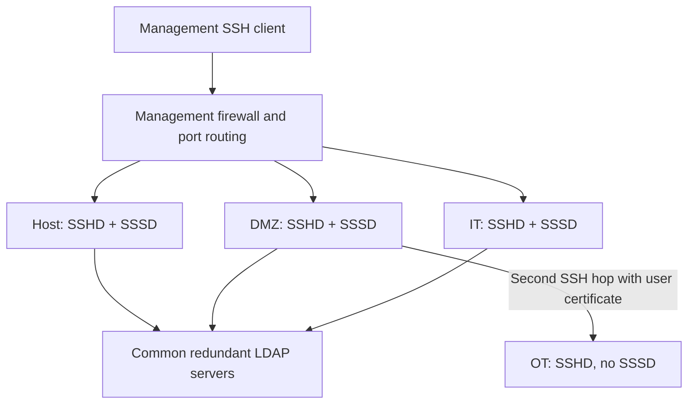
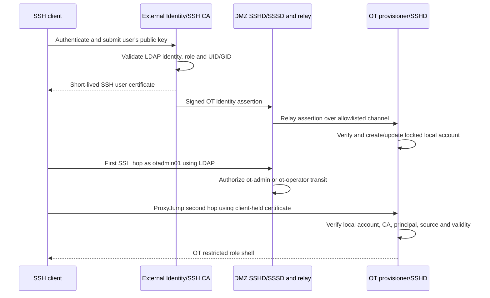
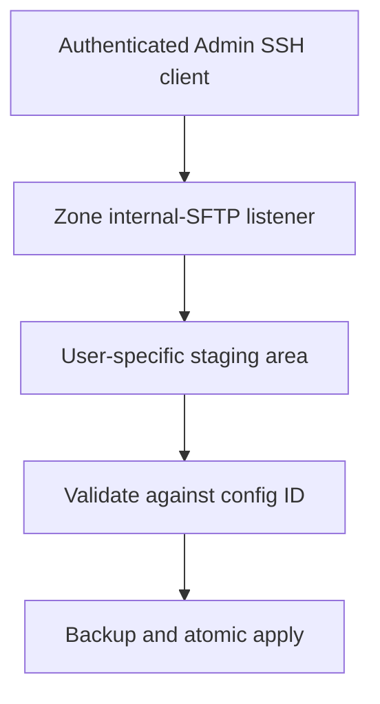

# Solution B — DMZ Jump Host and Offline OT Restricted SSH Design

**Document ID:** AIOT-SEC-SSH-SB  
**Version:** 2.1  
**Date:** 2026-09-04  
**Target:** AIoT gateway with unprivileged LXC zones

## 1. Purpose and decisions

This design provides role-controlled SSH administration for Host, DMZ, IT and OT. Host, DMZ and IT run SSHD with SSSD. OT runs SSHD but has no SSSD, LDAP route, Internet access or direct client route. OT access requires a second SSH hop from DMZ using a short-lived SSH user certificate. The LDAP username remains the Linux identity shown by `whoami` and `id` on both hops.

Decisions:

- `it-admin`, `ot-admin`, `dmz-admin` and `host-admin` can run approved commands, manage approved services and change only allowlisted configuration files in their authorized zone.
- `ot-admin` and `ot-operator` first authenticate to DMZ using LDAP/SSSD and may enter OT only through the controlled certificate-based second hop.
- Configuration uploads originate only from an authenticated SSH client and land in a non-executable staging directory; uploads never directly overwrite production files.
- `ot-operator` can run limited operational commands, view status/logs and restart selected OT services, but cannot change any file.
- `auditor` logs in only to Host and receives read-only access.
- No role receives arbitrary commands, arbitrary paths, unrestricted `sudo` or a general root shell.
- Ambient capabilities and capability inheritance are not used.

## 2. Architecture



Host, DMZ and IT connections terminate directly in the selected zone. OT is different: the client uses DMZ as an authenticated SSH jump host and then establishes an end-to-end certificate-authenticated SSH session to OT. The user's OT private key and certificate remain on the client. No `lxc-attach`, `nsenter`, agent forwarding or private-key storage in DMZ is used.

| Zone | Accepted LDAP groups | Components | Scope |
|---|---|---|---|
| Host | `host-admin`, `auditor` | SSHD, SSSD, restricted shells, helpers, audit view | Host |
| DMZ | `dmz-admin`, `ot-admin`, `ot-operator` | SSHD, SSSD, DMZ admin shell, OT jump shell | DMZ admin or OT transit only |
| IT | `it-admin` | SSHD, SSSD, admin shell, helpers | IT |
| OT | Trusted SSH certificate principals | SSHD, local accounts, role shells, helpers; no SSSD | OT |

Illustrative routing:

| External port | Destination/function |
|---:|---|
| 2222/2223/2225 | Host/IT/DMZ first-hop SSH |
| 3222/3223/3225 | Host/IT/DMZ Admin-only configuration SFTP |
| None | OT has no externally reachable SSH/SFTP port |

Management ports are LAN/management-VLAN only. WAN SSH, general tunnelling, X11 and SSH agent forwarding are denied. A DMZ `Match Group ot-transit` rule permits only `direct-tcpip` forwarding to the fixed OT SSH address/port using `AllowTcpForwarding local` and `PermitOpen`; it grants no DMZ shell. Firewall policy permits DMZ to OT only on OT SSH and the controlled identity-provisioning endpoint. OT has no Internet default route and no route to LDAP or KMS. Auditor and OT Operator have no upload subsystem. OT Admin may use SFTP through the same ProxyJump path, but OT confines it to configuration staging.

## 3. Identity and authentication

LDAP is authoritative for username, password or approved public key, unique `uidNumber`/`gidNumber`, groups and account state.

| Group | Example user | Login location |
|---|---|---|
| `it-admin` | `iotadmin01` | IT |
| `ot-admin` | `otadmin01` | DMZ, then OT certificate jump |
| `dmz-admin` | `dmzadmin01` | DMZ |
| `host-admin` | `hostadmin01` | Host |
| `ot-operator` | `otoperator01` | DMZ, then OT certificate jump |
| `auditor` | `auditor01` | Host |

LDAP IDs shall be globally unique, container-visible IDs such as `10001`; they must not equal Host-side LXC id-map bases such as `1200000`. On Host, DMZ and IT, SSSD resolves the identity and `pam_mkhomedir` creates a restrictive home on first login.

Only Host, DMZ and IT run SSSD. These three instances may use the same LDAP servers and CA but retain separate configuration, access filter and cache. LDAPS/StartTLS, hostname validation and explicit cache-expiry behavior are mandatory. OT never queries LDAP. With LDAP mTLS, use three separate SSSD client keys/certificates.

### 3.1 Why OT still needs a local account

An SSH user certificate proves that a CA authorized a principal; it does not create a Linux user. Before certificate authentication, OpenSSH calls NSS `getpwnam("otadmin01")`. If OT has neither SSSD nor a local `otadmin01` record, SSHD rejects the connection before certificate authorization. Therefore the design performs just-in-time (JIT) account provisioning immediately before the second SSH hop.

### 3.2 External certificate issuance, two-hop login and JIT provisioning



Detailed sequence:

1. The user generates or holds an SSH key pair on the client. The private key never leaves the client.
2. The user authenticates to the external Identity/SSH CA and submits the public key. The CA independently validates LDAP account state, `ot-admin`/`ot-operator` membership, UID/GID and issuance policy.
3. The CA issues a short-lived OpenSSH user certificate whose principal equals the LDAP username. It binds the role, serial, validity and expected DMZ source address and prohibits forwarding in the OT session.
4. In the same issuance transaction, the external service creates a signed OT identity assertion containing username, UID/GID, role, certificate serial, validity, nonce and OT audience. It sends the assertion to the DMZ identity relay; no private key is sent.
5. DMZ verifies the assertion signature and relays it over the allowlisted internal provisioning channel. OT verifies the pinned identity CA public key, issuer, audience, nonce, time, username syntax, role, ID range and collisions, then creates or refreshes the locked local account. Certificate issuance should not complete successfully until OT acknowledges provisioning; otherwise the user retries after synchronization.
6. The local account uses the exact LDAP username and UID/GID, a locked password (`!`), no static authorized keys, no sudo membership and the correct restricted shell. A restrictive home is created only when required. The local record cannot authenticate by itself.
7. The client starts `ssh -J otadmin01@dmz otadmin01@ot-internal` with its private key and external certificate. The first hop authenticates to DMZ through SSSD/LDAP. DMZ authorizes the transit group and opens only a channel to the fixed OT SSH endpoint.
8. The second SSH handshake is end-to-end between the client and OT. DMZ cannot use or read the private key and does not terminate OT authentication.
9. OT SSHD first resolves the JIT local account, then validates `TrustedUserCAKeys`, principal-to-username equality, serial/revocation state, validity and the DMZ `source-address` critical option. Certificate policy or the local account forces the OT Admin/Operator restricted shell.
10. After success, `whoami` reports `otadmin01`. At logout the client removes short-lived certificate material according to policy; the password-locked local identity may remain for stable ownership and auditing.

Example client configuration keeps the two authentication methods separate:

```sshconfig
Host gateway-dmz
    HostName gateway.example.com
    Port 2225
    User otadmin01
    PreferredAuthentications keyboard-interactive,password
    PubkeyAuthentication no

Host gateway-ot
    HostName ot.internal
    User otadmin01
    ProxyJump gateway-dmz
    IdentityFile ~/.ssh/id_ed25519_ot
    CertificateFile ~/.ssh/id_ed25519_ot-cert.pub
    PreferredAuthentications publickey
    IdentitiesOnly yes
```

The user runs `ssh gateway-ot`. OpenSSH authenticates the DMZ hop with LDAP and the OT hop with the client-held external certificate. The command looks like one operation to the user but creates two independent SSH security sessions.

### 3.3 Local account lifecycle and revocation

- JIT accounts may persist to keep stable file ownership, but remain password-locked and certificate-only.
- The signed assertion has a short lifetime and cannot be replayed; OT stores used nonces until expiration.
- The SSH certificate lifetime should normally be two to five minutes for connection establishment, with a bounded OT session lifetime.
- LDAP disablement immediately prevents issuance of new assertions/certificates. A periodically pushed, signed revocation/identity snapshot lets OT disable expired or revoked local accounts without LDAP access.
- The OT provisioner rejects username/UID collisions, UID changes for an existing username, role escalation and any ID outside the reserved OT administrative range.
- Account cleanup must not delete files blindly. Disabled identities remain mapped for audit and ownership until an approved retention/migration process completes.
- OT accepts provisioning and SSH only from the fixed DMZ addresses, but network origin is an additional check—not the sole trust control.

This design prevents a compromised DMZ process from inventing an OT identity because OT accepts only externally signed identity assertions and user certificates. Network origin from DMZ is necessary but not sufficient.

## 4. Authorization matrix

| Operation | IT Admin | OT Admin | DMZ Admin | Host Admin | OT Operator | Auditor |
|---|:---:|:---:|:---:|:---:|:---:|:---:|
| Zone/path | IT | DMZ → OT | DMZ | Host | DMZ → OT | Host |
| Approved diagnostics | Yes | Yes | Yes | Yes | Limited/read-only | Read-only |
| Read approved config | Yes | Yes | Yes | Yes | No by default | Yes |
| Edit approved config | Yes | Yes | Yes | Yes | No | No |
| Client configuration upload | Yes | Yes | Yes | Yes | No | No |
| Apply/rollback config | Yes | Yes | Yes | Yes | No | No |
| Delete optional config | Policy-controlled | Policy-controlled | Policy-controlled | Policy-controlled | No | No |
| Service status/logs | Yes | Yes | Yes | Yes | Yes | Yes |
| Restart approved service | Yes | Yes | Yes | Yes | Limited | No |
| Start/stop approved service | Policy-controlled | Policy-controlled | Policy-controlled | Policy-controlled | No | No |
| Arbitrary file/command/shell | No | No | No | No | No | No |

Authorization is default-deny and must match user, LDAP role, login zone, operation ID, resource ID and argument schema. Logical IDs replace paths and raw commands:

```text
config view nginx-main
config edit nginx-main
service restart nginx
log view nginx --lines 200
```

The interface never exposes `vi /path`, `rm /path`, `cp`, `systemctl *` or arbitrary command strings.

## 5. Restricted shell

SSHD `ForceCommand` starts a role-specific shell. The shell parses a small grammar without `/bin/sh -c`, rejects unknown options and directly executes fixed programs with fixed argument arrays.

Approved command families:

```text
help
session info
config list|view|edit|validate|apply|rollback|delete
service list|status|start|stop|restart
log list|view
diagnostic <approved-id>
resource status
security status
```

The role policy determines which verbs and IDs are visible. Pipes, redirection, substitutions, shell escapes, interpreters, user executables, user-controlled `PATH`/loader variables and alternate subsystems are prohibited.

## 6. Privileged helpers

Sessions remain their real unprivileged LDAP UID. Root-owned, function-specific helpers perform only protected operations:

| Helper | Function |
|---|---|
| `zone-config-control` | Validate, back up, install, roll back or remove approved config |
| `zone-service-control` | Query/control allowlisted services |
| `zone-log-read` | Return bounded output from protected approved logs |
| `zone-status-read` | Return approved health/resource/security data |

These are narrow privilege boundaries, not persistent general command brokers. Exact sudoers, a minimal setuid entry point or polkit may launch them. Never authorize `systemctl *`, `cp *`, `rm *` or `vi *`.

Every helper independently revalidates the caller UID, LDAP role, zone, operation and logical ID using root-owned policy. It uses absolute paths, a clean environment, restrictive umask, no-follow descriptor-based path handling, input/output limits and timeouts. Policy or audit initialization failure denies mutation.

## 7. Configuration-file management

Only exact configuration objects in the zone/role allowlist can be changed. The policy maps each `config-id` to a fixed target, validator, metadata and optional related service. Users never submit the production target path.

Example:

```yaml
configs:
  mosquitto-main:
    target: /etc/mosquitto/mosquitto.conf
    validator: mosquitto-config-check
    roles: [ot-admin]
    optional: false
```

### 7.1 Read and edit

`config view` performs safe fixed-target lookup, size bounds, optional secret redaction and auditing. Direct editing under `/etc` is forbidden.

`config edit` copies the current file to user staging, records its hash, opens only that staging copy as the LDAP user, validates it, displays a redacted diff and applies it through the helper. An editor must have shell escapes, alternate-file opening and arbitrary writes disabled. If reliable confinement is unavailable, interactive editing is omitted and upload plus validate/apply is required.

### 7.2 Client upload



- Only the four Admin roles may upload.
- Upload direction is client to the user's staging directory only.
- Staging is `noexec,nodev,nosuid`, quota/size/rate limited and periodically cleaned.
- Reject symlinks, hard links, devices, sockets, FIFOs, executables and invalid names/types.
- Upload never writes directly to `/etc`, `/usr` or another protected location.
- Upload does not activate content; the user invokes `config validate` and `config apply` with a logical ID.
- The helper rechecks ownership, type, link count, size and hash immediately before apply.

### 7.3 Atomic apply and rollback

The helper validates caller/policy and syntax/semantics, checks concurrent changes, creates a protected versioned backup, writes a temporary file in the target filesystem, assigns fixed owner/group/mode/ACL/SELinux label, calls `fsync`, and atomically renames it. It then performs post-validation and approved service reload/restart. Failure automatically restores the prior version.

Delete is denied by default. It is permitted only for a policy object marked `optional: true`, and moves the file to protected backup storage. Critical configuration uses disable/rollback instead.

Never allow these roles to modify passwd/shadow, PAM/SSSD, SSH keys/configuration, shell/helper/sudo policy, boot/kernel/LXC/firewall/SELinux policy, executables/libraries/startup scripts, audit evidence, TPM state or KMS credentials. Such changes require a signed system update or separate break-glass process.

## 8. Service management

Policy maps each logical service ID to one exact unit and allowed verbs. Wildcards, aliases and user-provided units are rejected.

```yaml
services:
  chirpstack:
    unit: chirpstack.service
    roles:
      ot-admin: [status, start, stop, restart]
      ot-operator: [status, restart]
```

The helper records pre/post state, enforces timeouts and may require a reason or maintenance window. Daemon reload, enable/disable, mask/unmask and unit-file editing are denied unless separately modeled.

## 9. OT Operator

The OT Operator authenticates first to DMZ and reaches OT only through ProxyJump with an external short-lived user certificate. Inside OT the role may:

- run an explicitly approved, read-only diagnostic set;
- view approved bounded logs and service status;
- restart only specifically allowlisted OT services.

The role cannot create, upload, edit, replace, rename or delete any file; apply or roll back configuration; start/stop services; run arbitrary `systemctl`; or use SCP, SFTP, shell, interpreter or `sudo`. Diagnostic wrappers supply fixed safe options and cannot modify state.

## 10. Auditor

The Auditor logs in only to Host and receives a read-only restricted shell. It may view approved configuration snapshots, logs, audit records, service status, resources and security/compliance status for Host and collected IT/OT/DMZ information.

Host-controlled collectors export approved zone evidence to a protected Host audit view. Auditor never enters a zone and cannot upload, create, edit or delete files; change service state; invoke privileged helpers with mutation verbs; use `sudo`, `lxc-attach` or `nsenter`; or alter evidence. Approved report download may be enabled as a read-only exception.

## 11. Host Admin boundary

Host Admin follows the same restricted design and only the Host allowlist. It does not automatically receive arbitrary root, arbitrary LXC control, zone impersonation or permission to change security policy/audit evidence. Emergency full-host access, if required, is a separate break-glass role with stronger authentication, short authorization, approval, session recording and review.

## 12. SSH certificates, external issuer and KMS

Each zone has a distinct private host key and OpenSSH host certificate with an expected principal such as `gateway-host`, `gateway-dmz`, `gateway-it` or `gateway-ot`. Host private keys are generated and retained on-device; KMS/Host CA signs only public host keys.

The external Identity/SSH CA separately issues short-lived OT **user** certificates to the user's client-held public key. OT stores only the SSH User CA public key in `TrustedUserCAKeys`; neither OT nor DMZ stores the external User CA private key. DMZ never obtains the user's private key or acts as the user for the second hop. Host and user certificate CAs should be logically separated even if one KMS protects both signing services.

Recommended SSHD controls include `PermitRootLogin no`, `AllowAgentForwarding no`, `X11Forwarding no`, `PermitTunnel no`, `GatewayPorts no`, `PermitUserEnvironment no`, group allowlists, session limits and `ForceCommand`. Forwarding is disabled by default. Only the DMZ OT-transit Match block enables local forwarding with `PermitOpen <OT-IP>:22`, no TTY and no DMZ command shell.

## 13. TPM confinement and capabilities

The physical TPM remains Host-only; `/dev/tpm0` and `/dev/tpmrm0` are not exposed to zones. A Host service may provide a narrow, authenticated TPM operation with separate objects, policy, rate limits and auditing.

Administrative shells/editors run as the real LDAP UID with no broad effective or ambient capability set. Only fixed helpers execute privileged operations. Therefore non-functional ambient/keep-caps support on the target kernel does not affect this design.

## 14. Audit requirements

Every accepted and rejected request records UTC time, session/request ID, LDAP username/UID/GID/role, source address, zone, normalized operation/resource, authorization result/reason, policy version, exit/duration and—when applicable—before/after hashes, validator result and service state. Secrets are never logged.

Logs are locally protected and forwarded to Host and/or a remote SIEM. Administrators cannot alter already-forwarded evidence. Apply quotas, rotation and retention; alert on repeated denials, policy tampering, validation failures and unusual restart frequency.

## 15. Failure behavior

| Failure | Behavior |
|---|---|
| Unresolved/disabled identity or role | Deny |
| Invalid/missing policy | Deny all administration |
| Audit initialization failure | Deny mutation |
| Upload quota exceeded | Reject without affecting active config |
| Config validation failure | Keep current config |
| Post-apply health failure | Restore backup |
| Service timeout | Report, audit and alert as policy requires |
| Expired SSH certificate | Reject; use controlled renewal/recovery |

## 16. Verification

1. Confirm direct client-to-OT and OT-to-Internet/LDAP/KMS routes are absent.
2. Confirm OT Admin/Operator must pass DMZ LDAP authentication and that DMZ forwarding reaches only the fixed OT SSH endpoint.
3. Confirm OT rejects missing, expired, wrong-principal, wrong-source, revoked or untrusted user certificates.
4. Confirm JIT provisioning occurs before SSHD account lookup and `whoami` in OT shows the original LDAP username.
5. Confirm DMZ never receives the user's private key and agent forwarding is disabled.
6. Test injection characters, paths, symlinks, hard links, races, devices, oversized uploads and output bounds.
7. Confirm each Admin changes only allowlisted configuration in its zone and OT uploads work only through the jump path.
8. Confirm OT Operator cannot change any file and can restart only approved OT services.
9. Confirm Auditor is Host-only/read-only and cannot modify files or service state.
10. Confirm sessions/editors have no ambient capabilities and correlate both SSH hops, certificate serial and helper audit events.

## 17. Deployment sequence

1. Define LDAP users, unique IDs and six role groups.
2. Configure zone networks, management ports and default-deny firewalls.
3. Deploy four SSHD instances, three SSSD instances and the DMZ OT-transit filter.
4. Provision four SSH host keys/certificates, LDAP trust for Host/DMZ/IT, and the external SSH User CA public key in OT.
5. Deploy restricted shells, independently validating helpers and signed root-owned policies.
6. Create Admin-only SFTP listeners and protected staging areas.
7. Configure first-login homes and protected/remote auditing.
8. Run positive, negative and race-condition security tests before enabling production access.

## 18. Normative requirement

Host, DMZ and IT shall authenticate SSH logins using their local SSSD against LDAP. OT shall have no SSSD, LDAP/KMS route, Internet access or direct external SSH route. OT Admin and OT Operator shall authenticate first to DMZ and establish an end-to-end second SSH session through the restricted DMZ jump path using a short-lived user certificate obtained by the user from an external trusted issuer.

Before the second hop, OT shall create or refresh a locked local account from an externally signed JIT identity assertion so that the Linux username and UID/GID match the LDAP identity. OT shall trust only pinned CA public keys; DMZ shall not possess the User CA private key or user private key.

IT Admin, OT Admin, DMZ Admin and Host Admin shall receive restricted shells permitting only approved commands, approved service actions and modification of explicitly allowlisted configuration files within their zone. Client uploads shall terminate only in a non-executable staging area and require validated, backed-up, atomic installation by a narrow privileged helper. OT upload shall traverse the authorized ProxyJump path.

OT Operator shall be limited to approved read-only diagnostics, status/log viewing and restart of specifically allowlisted OT services, with all file changes prohibited. Auditor shall log in only to Host and receive read-only access to approved Host and collected zone evidence, with all file and service changes prohibited.

No normal role shall receive unrestricted shell access, arbitrary commands or paths, unrestricted sudo, cross-zone shell access or broad Linux capabilities. The implementation shall not depend on ambient capabilities, and all operations shall be attributable to the authenticated LDAP username in protected audit logs.
