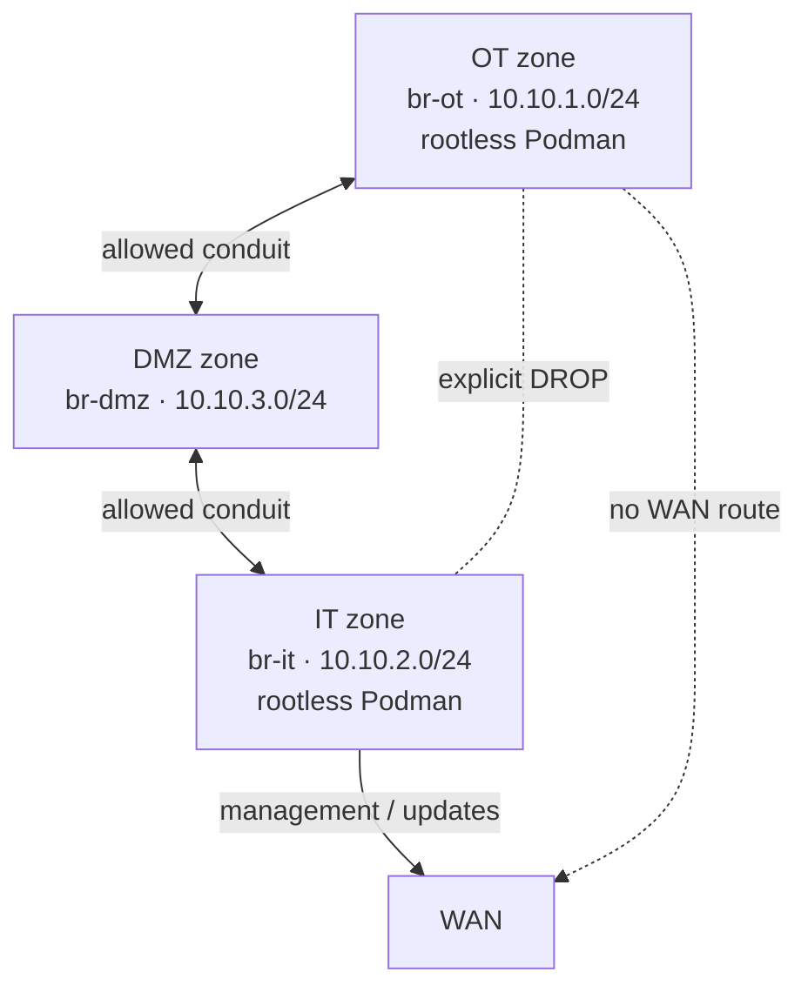

# OT/IT/DMZ Zone Architecture

Three isolated network-namespace security zones, each an unprivileged LXC system container running its own genuinely rootless podman — with a DMZ that mediates every byte that crosses between operational and IT traffic.

**Design snapshot:** `feat/ot-it-separation`  
**Work item:** `IQ91G-1607`  
**Target:** `qcs9075-iq-9075-evk`  
**Repository path:** `docs/ot-it-dmz-zones/design.md`

## Contents

1.  [Context](#context)
2.  [Scope limitation](#scope-limitation-no-physical-layer-segregation)
3.  [Zone / conduit model](#zone--conduit-model)
4.  [Firewall config ownership](#firewall-config-ownership)
5.  [UID/GID allocation](#uidgid-allocation)
6.  [The newuidmap problem](#the-newuidmap-problem)
7.  [Rootfs design](#rootfs-design-directories-only)
8.  [Known limitations](#known-limitations--follow-up)
9.  [Verification](#verification)

## Context

`feat/ot-it-separation` already replaced docker with rootless podman as the sole *application*-container engine, but kept `lxc`/`lxcfs` in `CONTAINER_PKGS` purely as a side effect of dropping the docker packagegroup bundle those packages used to arrive with. No actual LXC container had ever been defined — which is why, before this design, `lxcfs.service` crash-looped on every boot with no mountpoint to attach to.

This design defines the real architecture: **LXC provides three outer system containers — `ot`, `it`, `dmz` — each its own network-namespace security zone. Each zone runs its own nested, genuinely rootless podman instance for application workloads.** LXC is the zone/conduit boundary, matching the IEC 62443 zone-and-conduit model this project already tracks elsewhere; podman is the application runtime inside each zone. This is not a reversion of the docker→podman migration — LXC never runs application containers itself.

## Scope limitation: no physical-layer segregation

> **Read this first**

`wnc-ethsw-hal` is an explicit demo/simulation HAL that fabricates five logical LAN ports over a single real 1G RJ45 GMAC behind a DSA switch whose devicetree overlay isn't even in-tree yet — VLAN ID is hardcoded to `1` everywhere. There is no real VLAN or physical-port isolation on this platform today.

This design delivers **software-defined isolation only** — a per-zone Linux bridge, veth pair, and network namespace (LXC), enforced by nftables-level zone/conduit policy through the existing `CcspZoneFirewallSsp`. True physical-layer segregation would require new DSA devicetree and kernel bring-up work — a separate hardware project, not addressed here.

## Zone / conduit model

Three bridges, three subnets, one rule that never bends: operational and IT traffic never touch directly. DMZ is the only path between them.



The only conduit between operational and IT traffic runs through DMZ. A direct `OT↔IT` policy entry exists and reads `DROP` — the block isn't an absence of a rule, it's a rule. OT has no WAN policy at all; IT reaches WAN for management and updates.

Legend: solid links are allowed conduits; the crossed link is an explicit `DROP`; the dotted link indicates no route/policy.

### Zones

| Zone | Bridge   | Subnet       | Purpose                                                            |
|------|----------|--------------|--------------------------------------------------------------------|
| OT   | `br-ot`  | 10.10.1.0/24 | Operational technology workloads. No WAN egress by design.         |
| IT   | `br-it`  | 10.10.2.0/24 | IT / management workloads. Reaches WAN for updates and management. |
| DMZ  | `br-dmz` | 10.10.3.0/24 | Mediates all OT↔IT traffic. Never a direct conduit.                |

Protocol-level allow-listing within the DMZ↔OT conduit (Modbus, DNP3, OPC-UA, BACnet, MQTT) uses the existing `ZoneFirewallSsp_dm.xml` `IoT.` data model rather than duplicating that logic in the new policy entries.

## Firewall config ownership

`ccsp-zone-firewall` ships as a closed-source, prebuilt `.ipk`, installed via `inherit bin_package`. Its `defaults.json` — where `zones`, `zone_groups`, and `policies` live — is baked inside that binary, not source in this repo.

Following this project's "own the file, don't patch what you don't own" convention, the binary is never edited or repacked. A `.bbappend` overrides `defaults.json` via `FILESEXTRAPATHS` and `do_install:append`, starting from the real content read live off the DUT — the existing `LAN`/`WAN`/`VPN` zones and the `LAN→WAN` policy — plus the three new zones and conduits above.

## UID/GID allocation

Unprivileged LXC plus nested rootless podman means two layers of user-namespace remapping per zone. Existing host ranges — `sysadmin:100000:65536`, `docker_agent:100000:65536` plus a second `docker_agent:165536:65536` entry that already overlaps the first — are left untouched; they predate this design and aren't this feature's problem to fix. The three zone ranges start well clear of all of them.

| Zone | Outer host range (root subuid/subgid) | In-container `appuser` | Nested rootless range |
|---|---:|---:|---|
| OT | 1000000–1199999 (200000 wide) | 1000 | `appuser:100000:65536` |
| IT | 1200000–1399999 (200000 wide) | 1000 | `appuser:100000:65536` |
| DMZ | 1400000–1599999 (200000 wide) | 1000 | `appuser:100000:65536` |

### Why 200,000 IDs, not the conventional 65,536

Rootless podman running inside each zone needs its own nested subordinate range — numbers relative to the container's *own* ID space. A 65,536-wide outer `lxc.idmap` only gives the container in-container IDs 0–65535 to work with, which isn't enough room for a nested range starting at 100000. 200,000 gives headroom for the zone's real accounts (root=0, appuser=1000) plus the full nested range.

### Why the ranges live on `root`, not per-zone accounts

`newuidmap`/`newgidmap` check the subuid/subgid range registered for the *actual calling user*. `lxc@<zone>.service` runs as root — the stock, unmodified LXC systemd template — so root itself needs all three ranges, added via three separate `usermod -v/-w` calls (the flags append; they don't replace). Dedicated `ot-zone`/`it-zone`/ `dmz-zone` accounts were tried first and found to have no effect on which range `newuidmap` actually honors, since root is the real caller.

## The newuidmap problem

The hardest part of making rootless podman work *inside* an unprivileged LXC container: the host's real `newuidmap`/`newgidmap` are setuid-root binaries owned by **host** UID 0. Host UID 0 isn't represented at all inside a zone whose outer idmap range starts at, say, 1000000 — so the setuid bit resolves to nothing meaningful from inside the container, and every nested `newuidmap` call fails with `Operation not permitted`, no matter how subuid/subgid is configured.

The fix, confirmed working via hands-on DUT testing: each zone gets a **private copy** of `newuidmap`/`newgidmap` — not bind-mounted from the host — under its own `/usr/local/bin/`, with ownership set from the host side, before the container starts, to the zone's numeric idmap base. That makes the copy owned by in-container uid/gid 0 once `lxc.idmap` applies.

```sh
# lxc-zones-provision.sh, per zone (base = 1000000 for ot, etc.)
cp /usr/bin/newuidmap /usr/bin/newgidmap "${root}/usr/local/bin/"
chown "${base}:${base}" "${root}/usr/local/bin/newuidmap" "${root}/usr/local/bin/newgidmap"
chmod 4755 "${root}/usr/local/bin/newuidmap" "${root}/usr/local/bin/newgidmap"
```

`appuser`'s `PATH` inside the zone lists `/usr/local/bin` ahead of the bind-mounted `/usr/bin`, so podman finds these private copies first. Confirmed on-device: `podman info` as `appuser` reports `rootless: true` in all three zones.

## Rootfs design: directories only

Each zone's rootfs is a directory skeleton plus a handful of small identity files — no duplicated binaries. `podman`, `crun`, `netavark`, `aardvark-dns`, `catatonit`, and their shared libraries are bind-mounted read-only from the host (`/usr/bin`, `/usr/lib`, `/usr/libexec`, `/lib`, `/etc/containers`) — confirmed sufficient by testing: `podman info` inside a zone resolves `netavark` via the bind-mounted `/usr/libexec/podman/netavark` with no `$PATH` entry needed. No separate baked rootfs image, no runtime `lxc-create -t download` — deterministic, and no cost of tripling the container toolchain.

Because `/var` doesn't survive OSTree deployments, every zone's `/var/lib/lxc/<zone>/` content — rootfs skeleton, identity files, the private `newuidmap`/`newgidmap` copies, and the LXC `config` file itself — is recreated from scratch on every boot by `lxc-zones-provision.service`, ordered before all three `lxc@<zone>.service` instances via a `lxc@.service.d/override.conf` drop-in, not a patch to the upstream unit.

`lxc.init.cmd = /usr/bin/catatonit -P` replaces `/sbin/init` — each zone has no init system of its own by design, and `catatonit` is already an existing `RDEPENDS` of podman on the host, reused via the same bind mount. `lxc@.service`'s stock upstream template already ships `Delegate=yes`, so cgroup v2 delegation required no new configuration.

`/dev/net/tun` (needed for slirp4netns / rootless networking) must be bind-mounted from the host, not merely created on disk in the rootfs skeleton — LXC's `autodev` mounts a fresh tmpfs over `/dev` at container start, which shadows anything pre-created there. The `lxc.mount.entry` for `/dev/net/tun` applies *after* autodev's tmpfs is mounted, so it survives.

## Known limitations / follow-up

> **Status: not yet closed**

- **No physical-layer segregation** — see the scope note above. A real hardware/devicetree project, not addressed here.
- **Zero SELinux confinement** for lxc/podman/container processes. This project's distro-wide default is permissive, and everything here runs unconfined today. Before enforcing mode: real `lxc_zone_t`-style domains with explicit `allow` rules, following the existing build-capture-AVC-iterate methodology used elsewhere in this project.
- **Pre-existing `sysadmin`/`docker_agent` subuid/subgid overlap** was found during this work (both registered `100000:65536`) — flagged as a discovered gap, not fixed here; the new zone ranges were deliberately placed well clear of it.

## Verification

**Host** — `tests/host/T43_ot_it_dmz_zones_test.sh` lints every config and unit file, confirms the three zone UID/GID ranges don't overlap each other, and confirms `defaults.json`'s zone/policy JSON is valid and internally self-consistent.

**DUT** — `tests/dut/ot-it-dmz-zones/test_zones.sh` confirms all three `lxc@<zone>.service` instances are active, `podman info` as `appuser` inside each zone reports `rootless: true`, each zone's init process shows the correct host-side UID — the actual security-boundary proof — and the conduit policy blocks `OT↔IT` while allowing DMZ-mediated paths.

All of the above was proven hands-on against the live DUT, zone by zone, before any of it was baked into a recipe.
