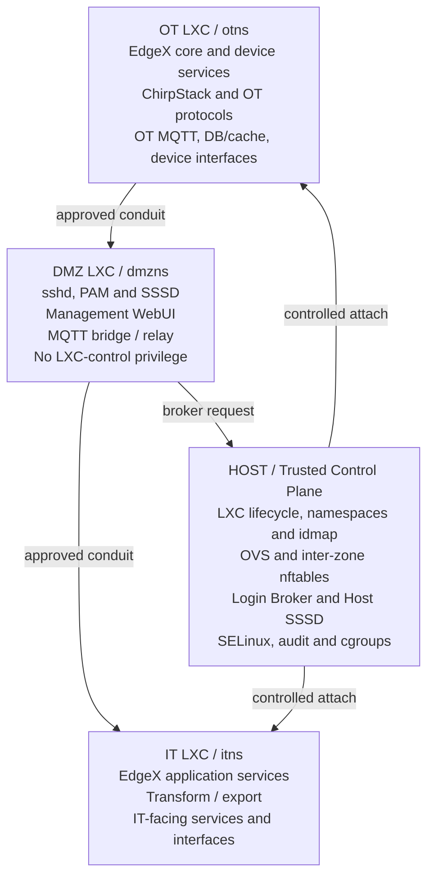

# IT/OT Separation Security Architecture Design

**LXC Namespace Model with DMZ SSH/SSSD Gateway**  
**Design version:** 0.1  
**Date:** 2026-09-03




*Figure 1. High-level zone and trust-boundary model*

# 1. Executive Summary

This document defines an IT/OT separation architecture for an AIoT gateway using Linux LXC containers and separate network/user namespaces. The design separates OT, DMZ, and IT services into dedicated LXC zones while retaining a minimal privileged Host as the trusted control plane. Remote SSH access terminates only in the DMZ LXC, where sshd, PAM, and SSSD perform the initial LDAP authentication. The DMZ is not permitted to execute nsenter/lxc-attach or manage sibling containers. A tightly controlled Host Login Broker performs cross-zone authorization and session creation.

The design emphasizes least privilege, explicit zone/conduit enforcement, independent Host-side authorization, auditability, and strict control of namespace transitions. Host Admin and Auditor use the Host as the management/observation plane; zone administrators are confined to their assigned LXC namespace.

# 2. Security Objectives and Design Principles

- Strongly separate OT, IT, and DMZ runtime environments using LXC namespaces and non-overlapping UID/GID mappings.

- Prevent direct OT-to-IT Layer-2 or Layer-3 bypass paths; all cross-zone communication must use explicitly approved conduits.

- Use the DMZ as the only normal remote SSH ingress point.

- Keep LXC management, namespace transition, OVS, firewall, SELinux, and other high-impact controls on the Host.

- Never trust UID, GID, role, container name, or session identifiers supplied by a DMZ client as authoritative security attributes.

- Apply role-to-zone authorization on the Host.

- Provide cross-zone Host visibility for Host Admin and read-only cross-zone visibility for Auditor.

- Centralize logging and preserve an auditable record of authentication, authorization, namespace access, configuration changes, and service operations.

# 3. Zone and Component Placement

| **Zone**        | **Primary Components**                                                                                             | **Security Constraint**                                                                                                                                         |
|-----------------|--------------------------------------------------------------------------------------------------------------------|-----------------------------------------------------------------------------------------------------------------------------------------------------------------|
| OT LXC (otns)   | OT applications, EdgeX Core/Device Services, ChirpStack, OT MQTT, OT-local DB/cache, assigned OT device interfaces | No direct IT administrative access; no host-management capability.                                                                                              |
| DMZ LXC (dmzns) | sshd, PAM, SSSD, management WebUI, MQTT bridge/relay                                                               | Remote authentication ingress. Must not receive host /proc, LXC control sockets, arbitrary host D-Bus, or CAP_SYS_ADMIN sufficient for sibling namespace entry. |
| IT LXC (itns)   | EdgeX application services, transform/export, northbound integrations                                              | No direct OT device access. Access to OT data only through approved DMZ conduit.                                                                                |
| Host            | Kernel, LXC, OVS, inter-zone firewall, SELinux, cgroups, Host SSSD, Login Broker, audit controls                   | Trusted control plane. Only component permitted to attach to or transition into sibling LXC namespaces.                                                         |

# 4. Network Separation and Conduits

The Host shall enforce inter-zone communication. OVS provides connectivity but shall not create an unrestricted shared Layer-2 broadcast domain between OT, DMZ, and IT.

| **Source**          | **Destination** | **Default**                      | **Typical Exception**                                   |
|---------------------|-----------------|----------------------------------|---------------------------------------------------------|
| OT                  | IT              | DENY                             | None; use OT -\> DMZ -\> IT mediated path.              |
| IT                  | OT              | DENY                             | Only explicitly approved command/API paths if required. |
| OT                  | DMZ             | DENY except allowlist            | MQTT/TLS or approved management telemetry.              |
| DMZ                 | IT              | DENY except allowlist            | MQTT/TLS / approved northbound API.                     |
| DMZ                 | Host            | DENY except broker interface     | Host Login Broker socket/API only.                      |
| External management | DMZ             | DENY except management allowlist | SSH/HTTPS from approved management networks.            |

# 5. RBAC Model

| **Role**    | **Login Location** | **Visibility**       | **Modification Scope**                                      | **Namespace Transition**  |
|-------------|--------------------|----------------------|-------------------------------------------------------------|---------------------------|
| OT Admin    | OT LXC             | OT only              | Modify OT services/configuration; controlled sudo if needed | No                        |
| DMZ Admin   | DMZ LXC            | DMZ only             | Modify DMZ services/configuration                           | No                        |
| IT Admin    | IT LXC             | IT only              | Modify IT services/configuration                            | No                        |
| OT Operator | OT LXC             | OT only              | Limited operational actions; no broad sudo                  | No                        |
| Host Admin  | Host               | Host + OT + DMZ + IT | Full administrative control subject to policy               | Controlled / allowed      |
| Auditor     | Host               | Host + OT + DMZ + IT | Read-only inspection                                        | No interactive transition |

Recommended LDAP groups:

- gw-ot-admin

- gw-dmz-admin

- gw-it-admin

- gw-ot-operator

- gw-host-admin

- gw-auditor

# 6. Remote Login and Cross-Zone Session Flow

All normal remote SSH connections terminate in the DMZ LXC. The initial user authentication uses PAM + SSSD against LDAP/AD over TLS.

| **Step** | **Action**                                                                                                                                                             |
|----------|------------------------------------------------------------------------------------------------------------------------------------------------------------------------|
| 1        | User connects to the gateway management address using SSH. The connection terminates at DMZ sshd.                                                                      |
| 2        | DMZ sshd invokes PAM/SSSD and validates the LDAP username/password.                                                                                                    |
| 3        | After successful authentication, sshd runs a controlled ForceCommand/login helper instead of granting arbitrary cross-zone capability.                                 |
| 4        | For a DMZ Admin, the authenticated session may remain in DMZ according to DMZ policy.                                                                                  |
| 5        | For OT Admin, IT Admin, OT Operator, Host Admin, or Auditor, the helper requests the intended target from the Host Login Broker.                                       |
| 6        | The Host Broker treats all identity attributes supplied by DMZ as untrusted request data. The Host independently authenticates/authorizes the user as described below. |
| 7        | The Host maps the verified LDAP role to an allowed destination and creates the session. OT/IT users are attached to their LXC; Host Admin/Auditor remain on Host.      |

# 7. Host Login Broker Design

The Host Login Broker shall be a small privileged service. It is not a generic remote-command daemon. Its only purpose is to authenticate/authorize an administrative session and create that session in an allowlisted destination.

## 7.1 Broker Request Contract

The DMZ helper should send the minimum request information, for example:

```text
username=alice
requested_target=OT
```

The following DMZ-provided values must not be trusted and should either be omitted or ignored: UID, GID, role, container name, privilege level, command line, and session ID.

## 7.2 Independent Host Re-authentication

For the selected design, the Host re-authenticates the human user against LDAP before crossing into OT/IT/Host. The Broker uses a Host-side PAM service and Host-side SSSD. The user is prompted for the LDAP password again. The Host then calls pam_authenticate() and pam_acct_mgmt(); after success, NSS/SSSD is used to resolve the authoritative UID, GID, group memberships, and account status.

Example Host-side flow:

```text
pam_start("lxc-broker", "alice", ...)
pam_authenticate(...)
pam_acct_mgmt(...)
getpwnam("alice")
getgrouplist("alice", ...)
```

## 7.3 Host-owned Authorization Mapping

| **Verified LDAP Group** | **Allowed Target** | **Result**                                         |
|-------------------------|--------------------|----------------------------------------------------|
| gw-ot-admin             | OT                 | Attach to otns as the verified non-root user.      |
| gw-ot-operator          | OT                 | Attach to otns with limited operational privilege. |
| gw-it-admin             | IT                 | Attach to itns as the verified non-root user.      |
| gw-dmz-admin            | DMZ                | Remain/use DMZ administrative environment.         |
| gw-host-admin           | Host               | Host administrative session.                       |
| gw-auditor              | Host               | Constrained read-only Host audit session.          |

A requested target that does not match the verified role shall be denied. The client cannot override the physical container name. Mapping such as OT -\> otns and IT -\> itns is maintained only by the Host policy.

# 8. Important Threat-Model Limitation of Password Re-authentication

**Security caveat:** because the SSH transport terminates in the DMZ, a fully compromised DMZ root can potentially observe or manipulate terminal input, including a second password entered through that SSH session. Therefore Host-side LDAP re-authentication strongly protects against ordinary DMZ-user spoofing and forged UID/GID/role values, but it does not provide cryptographic end-to-end proof against a fully compromised DMZ root.

If the threat model requires protection even after full DMZ root compromise, use an end-to-end user credential that the DMZ cannot forge or capture in reusable form (for example, short-lived SSH user certificates/private-key proof, a dedicated management channel terminating on the Host, or another signed per-user assertion).

# 9. LXC Namespace and UID/GID Design

Each zone should use a dedicated non-overlapping user-namespace mapping. LDAP UID/GID values exposed inside a container must be representable in that container's configured idmap; absolute host-mapped UID bases must not be reused as in-container LDAP uidNumber values.

| **Control**          | **Requirement**                                                                                                                              |
|----------------------|----------------------------------------------------------------------------------------------------------------------------------------------|
| User namespace       | OT, DMZ, and IT use separate, non-overlapping host UID/GID ranges.                                                                           |
| LDAP UID/GID         | Use stable logical user IDs that fit the relevant container mapping; do not set LDAP uidNumber equal to the zone's absolute host idmap base. |
| Device access        | Only explicitly assigned OT devices are exposed to otns. IT/DMZ receive no unnecessary OT device nodes.                                      |
| Host capabilities    | DMZ does not receive CAP_SYS_ADMIN or host namespace visibility sufficient to nsenter sibling containers.                                    |
| Container management | lxc-attach/setns is performed only by Host-side trusted services or Host Admin policy.                                                       |

# 10. Host Admin and Auditor Operation

Host Admin and Auditor do not need separate SSH daemons or separate SSH logins in OT/IT/DMZ for routine work. The Host is the single management/observation point for these cross-zone roles.

| **Role**   | **Host Capabilities**                                                           | **Cross-zone Operation**                                                                          |
|------------|---------------------------------------------------------------------------------|---------------------------------------------------------------------------------------------------|
| Host Admin | LXC lifecycle, OVS, firewall, service management, diagnostics                   | May use controlled lxc-attach or host wrappers to inspect/restart approved services in OT/IT/DMZ. |
| Auditor    | Read-only audit interface, logs, service state, configs, process/resource state | No sudo, no service restart, no arbitrary nsenter/lxc-attach, no configuration writes.            |

## 10.1 Read-only Audit Interface

The Auditor should use allowlisted read-only commands through an audit helper rather than an unrestricted privileged shell. Example logical operations:

- audit services OT\|IT\|DMZ

- audit logs OT\|IT\|DMZ

- audit config OT\|IT\|DMZ \<allowlisted-path\>

- audit resources OT\|IT\|DMZ

- audit hash OT\|IT\|DMZ \<allowlisted-path\>

The helper may internally use lxc-attach to run read-only commands, but the Auditor is not granted arbitrary lxc-attach access.

# 11. Service Management

The Host can operate services in an LXC without SSHing into that LXC. Example:

```sh
lxc-attach -n otns -- systemctl restart mosquitto
lxc-attach -n itns -- systemctl status edgex-app-service
lxc-attach -n dmzns -- journalctl -u sshd
```

For non-Host roles, prefer allowlisted service-control wrappers over arbitrary lxc-attach. Example policy: OT Admin may restart approved OT services; IT Admin may restart approved IT services; DMZ Admin may restart approved DMZ services; Auditor cannot restart services; OT Operator normally cannot restart infrastructure services.

# 12. Broker and Host Hardening Requirements

| **Control**       | **Requirement**                                                                                                                                           |
|-------------------|-----------------------------------------------------------------------------------------------------------------------------------------------------------|
| Unix socket/API   | Expose only the Login Broker endpoint to DMZ. Do not expose /proc, /run/lxc, host D-Bus, Docker/Podman sockets, or other broad control surfaces.          |
| Peer validation   | Use Unix-socket ownership/mode and SO_PEERCRED for service-level caller validation. Treat this as helper-process validation, not proof of the human user. |
| Input validation  | Accept only fixed target enums such as OT, IT, DMZ, HOST. Never accept arbitrary PID, container name, command, path, UID, GID, or role.                   |
| Command execution | Use fixed execve/subprocess argument vectors; never construct shell commands from client input.                                                           |
| SELinux           | Run the broker in a dedicated confined domain with only the minimum namespace/LXC/audit permissions.                                                      |
| No general shell  | The broker shall not expose arbitrary command execution.                                                                                                  |
| Audit             | Record allow/deny decision, verified user, LDAP groups, target, source address, Host-generated session ID, start/end time, and administrative action.     |
| Rate limiting     | Limit repeated authentication/broker attempts and apply account lockout policy consistently with the identity service.                                    |

# 13. Audit and Logging

At minimum, retain the following security events:

- DMZ SSH connection accepted/rejected and source address.

- DMZ PAM/SSSD authentication result (without passwords).

- Host Broker re-authentication result.

- Authoritative LDAP groups used for authorization.

- Requested and resolved target zone.

- Host-generated session identifier.

- LXC attach/start/end event and exit status.

- Service restart/configuration changes by administrators.

- Auditor read operations when required by policy.

- Firewall/SELinux denials relevant to zone separation.

# 14. LDAP Availability and Failure Policy

Because the selected design relies on Host-side LDAP re-authentication for cross-zone access, the product shall define an explicit policy for LDAP outage/island mode. Recommended default: deny new cross-zone administrative sessions when the Host cannot obtain current authentication/account status. If SSSD cached authentication is permitted, its validity period and emergency-use policy must be documented and auditable.

# 15. Security Verification Test Plan

| **ID** | **Test**                   | **Action**                                                                                | **Expected**                                                     |
|--------|----------------------------|-------------------------------------------------------------------------------------------|------------------------------------------------------------------|
| T01    | OT Admin login             | Valid OT Admin authenticates in DMZ, re-authenticates at Host, lands in otns only.        | PASS                                                             |
| T02    | IT Admin isolation         | IT Admin requests OT target.                                                              | DENY                                                             |
| T03    | Forged UID/GID             | DMZ request supplies fake UID/GID/root values.                                            | Host ignores them and derives identity via SSSD.                 |
| T04    | Forged role                | DMZ request says role=HostAdmin for an OT user.                                           | DENY; Host uses LDAP groups only.                                |
| T05    | Arbitrary container        | Client requests non-allowlisted container/PID.                                            | Protocol rejects request.                                        |
| T06    | DMZ user nsenter           | Normal/root-equivalent app user in DMZ attempts sibling namespace entry.                  | DENY by namespace/capability/SELinux design.                     |
| T07    | Auditor write              | Auditor attempts service restart/config write.                                            | DENY and audit.                                                  |
| T08    | Host Admin service control | Host Admin restarts approved service in otns through Host tooling.                        | PASS and audit.                                                  |
| T09    | OT-to-IT bypass            | Attempt direct OT-to-IT network connection outside approved conduit.                      | DROP.                                                            |
| T10    | LDAP account disable       | Disable user/remove group centrally, then attempt new cross-zone login.                   | DENY on current Host lookup.                                     |
| T11    | LDAP unavailable           | Attempt new cross-zone login during LDAP outage.                                          | Behavior matches documented fail-closed/cache policy.            |
| T12    | DMZ compromise scenario    | Validate documented residual risk: DMZ root can observe DMZ-terminated SSH session input. | Risk documented; stronger credential option tracked if required. |

# 16. Deployment Checklist

- Create otns, dmzns, and itns LXC containers with non-overlapping idmap ranges.

- Move sshd + PAM + SSSD into dmzns and restrict remote SSH ingress to dmzns only.

- Configure LDAP/AD connectivity over TLS and validate account/group lookups.

- Install Host SSSD for authoritative Host-side re-authentication and group resolution.

- Implement Host Login Broker and narrow DMZ-to-Host broker endpoint.

- Implement host-owned role-to-target policy and deny arbitrary container/PID/command input.

- Constrain broker and helper processes with SELinux and filesystem/socket permissions.

- Implement OVS/VLAN and host firewall policy with no OT\<-\>IT bypass path.

- Create Host Admin and read-only Auditor profiles.

- Centralize/forward logs and verify audit retention.

- Run the verification test plan before release.

# 17. Final Architecture Decision

The selected architecture uses LXC namespaces to enforce IT/OT/DMZ runtime separation. sshd and SSSD reside in the DMZ and provide the common remote authentication ingress. The Host remains the sole namespace-control authority. Cross-zone sessions are created only by a Host Login Broker after independent Host-side LDAP re-authentication and Host-owned RBAC evaluation. Zone administrators are confined to their own zone, while Host Admin and Auditor use Host-side management/audit functions for cross-zone visibility. The Auditor is read-only.

**Key rule:** The DMZ may request access, but only the Host authenticates/authorizes the cross-zone transition and only the Host performs lxc-attach/setns.
